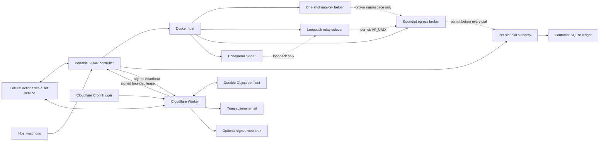

# Portable GHAR

[](https://github.com/sumitake/Portable-GHAR/actions/workflows/ci.yml)
[](https://github.com/sumitake/Portable-GHAR/actions/workflows/codeql.yml)
[](https://github.com/sumitake/Portable-GHAR/actions/workflows/sanitization.yml)
[](LICENSE)

## Status

**Pre-deployment. Experimental. Public-preview upstream dependency.**

This repository contains the Phase 2 source implementation of the local
Portable GHAR controller and isolation runtime, including its runner,
adapter, broker, helper, verifier, host-lifecycle, conformance, and
reproducible-build seams. **Source complete does not mean fully verified
or deployed:** positive Linux/Docker operational evidence, forced-runner-
version-bump evidence, the operator-approved host sizing tuple, external
failover, workflow migration, and live activation remain separate gates.
Nothing in this README is a claim that Portable GHAR is running on a live
host today.

Portable GHAR also depends on `actions/scaleset`, a **public-preview**
GitHub client interface, not a stable or official GitHub API. This project
is **not an official GitHub project**; it is presented as experimental
until its own compatibility and migration gates pass against a live
deployment.

## Purpose

Portable GHAR is a public, portable control plane for ephemeral GitHub
Actions runners on a Linux Docker host, with QNAP/QTS as the first
reference host. It replaces fixed, always-online self-hosted runner slots
with on-demand ephemeral runners that:

- launch one fresh runner container per assigned job and destroy it after;
- keep Docker control, GitHub App credentials, and notification
  credentials outside job containers;
- fail closed when a runner's egress policy cannot be installed or
  verified; and
- route work back to GitHub-hosted runners whenever the local fleet is
  unhealthy, using an authority that lives entirely outside the Docker
  host and its local network.

Portable GHAR provides **no hosted service**: an operator runs it against
their own Docker host and their own Cloudflare account, and the project
does not operate a shared control plane on anyone's behalf. Isolation is
**container-grade only** -- this project does not claim VM-grade
isolation; see [Trust boundaries](#trust-boundaries) for the full,
explicit non-claims list.

### Standalone boundary

Portable GHAR's source, build, tests, release artifacts, deployment tools,
and runtime are self-contained in this repository plus its declared public
dependencies. No consumer repository, collaboration broker, reviewer plugin,
or developer workspace is a required component. External review tools are
replaceable development aids, and consumer repositories are optional workload
integrations selected from a deployment's live inventory; neither is part of
the Portable GHAR product or a prerequisite for Phase 2 source completeness.

### Engineering baseline

Correctness, security, operational reliability, practical simplicity, and
clear boundaries are co-equal acceptance criteria. External work is bounded,
external effects are read back, failure degrades to a named safe state, and
retries and resource growth are capped. The design uses one lifecycle engine,
one external routing writer, one durable due-work scheduler, and one signed
acquisition-lease protocol. New machinery is accepted only when a current
requirement cannot be met safely by an existing proven primitive.

## Architecture



There is no inbound route to the Docker host; the host only ever
initiates outbound connections. Full detail, including the persisted job
state machine and capacity model, is in
[docs/architecture/overview.md](docs/architecture/overview.md).

## Trust boundaries

Docker control is host-root-equivalent, so the controller, host watchdog,
network-policy helper/verifier images, Cloudflare Worker and Durable
Object, and the controller/failover GitHub Apps are all treated as
trusted. Repository content, job code, dependencies, and job output are
always untrusted. The one-job JIT runner credential is bounded by scope
and lifetime, not hidden from the job that holds it. Full detail,
including the egress barrier and the shared-kernel boundary, is in
[docs/security/trust-boundaries.md](docs/security/trust-boundaries.md).

## Intended production lifecycle

Once deployed, each job assignment moves through a persisted state
machine so a controller restart can reconcile in-flight work without
duplicating it, and a new install always starts as a force-disabled,
zero-capacity dark-deployment observer under an existing fleet's fence
before it is ever handed live acquisition. Upgrades pass through
host-profile conformance probes before acquisition resumes. Full detail
is in
[docs/operations/production-lifecycle.md](docs/operations/production-lifecycle.md).

## Deployment and rollback gates

A rollback from Portable GHAR to a prior fleet is a strict, mutually
exclusive barrier: the new and legacy fleets can never acquire work
concurrently, an authenticated hosted hold is the only maintenance
freeze in the design, and every step is gated on a positive read-back of
GitHub or Docker state rather than an assumption. Full detail is in
[docs/operations/deployment-and-rollback.md](docs/operations/deployment-and-rollback.md).

## Failover and notifications design

Cloudflare Worker enrollment epochs are server-owned, not host-chosen;
replayed and reordered heartbeats are rejected; every GitHub-facing
routing mutation is staged through a durable outbox before it is
attempted; one Cron Trigger addresses every object in a bounded validated
private fleet inventory and recovers due work; and failback to self-hosted
routing is gated on a current-epoch canary followed by a fresh full-capacity
route-readiness heartbeat, exact self-hosted read-back, and only then a
subsequent matching heartbeat with a signed enabled lease before local
acquisition. Email and webhook notifications retry independently of each other,
and notification failure never blocks routing safety. Full detail is in
[docs/operations/failover-and-notifications.md](docs/operations/failover-and-notifications.md).

## Workflow migration plan

Migrating a repository's workflows onto the Portable GHAR routing
contract never renames required status checks, is evaluated per workflow
rather than per repository, and keeps secret-bearing, release,
deployment-write, and other unsupported job classes on GitHub-hosted
runners regardless of local capacity. Route confirmation relies on route
attestation -- an in-workflow proof of `runner.environment` -- rather than
a bare variable read. Full detail is in
[docs/operations/workflow-migration.md](docs/operations/workflow-migration.md).

## Operations

The host watchdog's authority is a restart authority, never a routing
authority: it can recover a dead controller process but can never change
where a repository's jobs run. Incident evidence is built from sanitized,
schema-defined fields, never raw logs or secrets, and rollback material is
retained for a documented window after any fleet retirement. Full detail
is in [docs/operations/operations.md](docs/operations/operations.md).

## Repository map

```text
cmd/            controller, watchdog, runner-gate, and isolation binaries
internal/       controller, lifecycle, isolation, state, and release packages
worker/         pre-deployment Cloudflare Worker/Durable Object source
images/         runner, network-adapter/broker/helper/verifier image roots
deploy/         host-adapter integration (QTS, systemd)
config/         schema/ and examples/ for the synthetic public contracts
scripts/        sanitization, schema validation, and docs tooling
tests/          Go, Vitest, Python, and Bats test suites
docs/           architecture, security, and operations documentation
```

Every public example, such as
[`config/examples/fleet.example.json`](config/examples/fleet.example.json),
uses only synthetic values -- `owner/repository`, `example-fleet`, and
`operator@example.invalid` -- validated against a closed schema, such as
[`config/schema/fleet.schema.json`](config/schema/fleet.schema.json).

## Development and CI

Toolchains are pinned: Go 1.26.5, Node.js 24.18.0, npm 12.0.1, and
TypeScript 6.0.3. Every pull request is required to pass hosted checks
covering Go (format, vet, tests, race, static analysis, vulnerability
scan), the Worker (lint, typecheck, Vitest), shell (ShellCheck, Bats),
repository metadata (Markdown, schemas, formatting), sanitization,
container scanning, and dependency review -- all on GitHub-hosted
runners, never on this project's own runner controller. Common local
commands:

```sh
go test ./...
npm run worker:test
npm run schema:test && npm run schema:validate
npm run lint:docs
python3 scripts/sanitize_public.py --tracked
```

## Release and security

[`scripts/sanitize_public.py`](scripts/sanitize_public.py) is a
fail-closed public-source sanitizer: it rejects private/loopback/
link-local literals, PEM and credential-shaped blocks, personal paths,
non-synthetic identifiers, and deployment-specific values in tracked and
generated output alike, and a release cannot proceed when it fails.
Phase 2 source defines reproducible source and runtime release pipelines:
clean independent rebuilds, the full required-check suite, filesystem and
image scanning, SBOM and third-party license inventories, checksums, and
provenance attestations for published artifacts. Those paths remain
pre-deployment until their deferred Linux/Docker and operational evidence
gates pass. Repository settings such as branch protection and required
status checks are applied only after every stable check has passed once on
a reviewed pull request head -- a merge is not itself a deployment.

## Docs and license

- [Architecture overview](docs/architecture/overview.md)
- [Trust boundaries](docs/security/trust-boundaries.md)
- [Production lifecycle](docs/operations/production-lifecycle.md)
- [Deployment and rollback](docs/operations/deployment-and-rollback.md)
- [Failover and notifications](docs/operations/failover-and-notifications.md)
- [Workflow migration](docs/operations/workflow-migration.md)
- [Operations](docs/operations/operations.md)

Portable GHAR is licensed under the [Mozilla Public License 2.0](LICENSE).

This section -- and any future claim that the controller, failover,
notifications, migration, or rollback path described above is live or
verified -- is updated only **after** a live deployment, rollback,
failover/notification, and workflow-migration exercise all pass their
own positive read-back gates. Until then, every subsystem described in
this README is pre-deployment and unverified against a live system.
