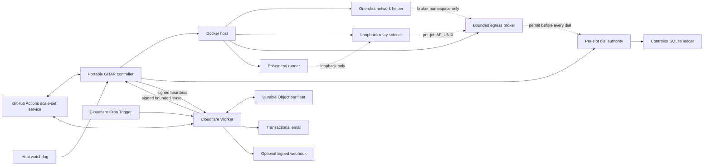

# Architecture overview

Portable GHAR is a public, portable control plane for ephemeral GitHub
Actions runners on a Linux Docker host. This page summarizes the shipped
design at a level safe for a public repository: mechanism and guarantees,
never a deployment's real hosts, paths, repository inventory, or
credentials. The authoritative, review-gated design record lives at
`docs/superpowers/specs/2026-07-10-portable-ghar-platform-design.md`; this
page is a truthful summary of it, not a replacement for it.

Phase 2 source now includes the local controller, isolation components,
host adapters, conformance harnesses, and release tooling described here.
It remains pre-deployment: Linux/Docker operational evidence, the
operator-approved sizing tuple, external failover and migration, and live
activation are later gates. See
[Trust boundaries](../security/trust-boundaries.md) for the companion
security model and the [operations runbooks](../operations/operations.md)
for the source-ready lifecycle contracts.

## Components

- **Portable GHAR controller** -- a host process that wraps the
  public-preview `actions/scaleset` client behind a pinned internal
  adapter, reconciles assigned jobs, enforces fleet-wide capacity, and
  drives one ephemeral runner container per job through a persisted state
  machine.
- **Docker host** -- the Linux host running the Docker daemon. Docker
  control is host-root-equivalent, so the controller is a trusted host
  process even when its own Unix account is not UID 0.
- **One-shot network helper** -- a `NET_ADMIN`-only process that installs a
  runner's egress policy into a held, unlisted broker namespace and then
  exits; it never has a network-application capability of its own.
- **Loopback relay adapter** -- a per-job sidecar that owns the runner's
  empty network namespace and relays exactly one loopback TCP connection
  to the bounded egress broker; it does not parse or dial.
- **Bounded egress broker** -- a per-job, capability-less process split into
  a parser (reads untrusted CONNECT/SOCKS bytes, creates no socket) and a
  dialer (owns every real network socket, re-validates every request,
  consumes a durable dial permit before each `connect()`).
- **Per-slot dial authority** -- a controller-owned component that grants
  one durable dial permit per attempted connection, backed by the
  controller's private SQLite ledger.
- **Ephemeral runner** -- a fresh container that runs exactly one job's
  listener and job process, holds no reusable credential, and is destroyed
  after the job ends.
- **Host watchdog** -- a local process that can restart a missing or failed
  controller and report local health; it has no routing authority.
- **Cloudflare Worker and Durable Object** -- the external failover control
  plane: one Durable Object per fleet owns the fleet's enrollment epoch,
  heartbeat state, short-lived signed acquisition lease, and GitHub
  routing-variable outbox. One Cloudflare Cron Trigger is the sole durable
  scheduler for persisted due work.
- **Transactional email and optional signed webhook** -- the two
  notification channels the Worker drives on a routing transition.

## Data flow



There is **no inbound route to the Docker host**. The host only ever
initiates outbound connections: to GitHub for job assignment, and to the
Worker for the signed heartbeat. Nothing outside the host can reach the
controller, a runner, or the Docker daemon directly.

Every job gets **one fresh runner container, and only that job**: the
controller creates a runner, the runner's listener runs exactly one job,
and the runner is destroyed immediately after -- successful, failed, or
cancelled. No runner is reused across jobs, and zero idle runner
containers is the default steady state.

Before a runner's listener can start, the controller's **one-shot network
helper installs and verifies the runner's egress policy, then exits** --
it never runs concurrently with the untrusted listener. Only after the
helper has exited, and an independent verifier has proven the expected
egress behavior from the actual runner namespace, does the controller arm
and release the runner's job credential over a private, per-runner
transport. The listener itself only ever starts after that sequence
completes.

The **Cloudflare Worker, together with exactly one Durable Object per
fleet, is the sole automatic writer of GitHub workflow routing state**. No
process on the Docker host -- controller, watchdog, or otherwise -- can
change which runners a repository's workflows target. The host only
publishes a signed heartbeat; the Worker decides and writes routing and returns
one short-lived signed acquisition lease. If that lease cannot be renewed, new
local acquisition stops while already-running jobs drain.

## Capacity and fairness

Capacity is expressed as resource units charged against a fleet-wide
ceiling, not as a count of pre-registered runners. Each stable capacity
slot's admission charge covers the runner, its adapter, its held/running
broker, its per-slot dial-authority and socket state, its durable ledger
allocation, and the larger of its serialized helper/verifier transient
peaks.

- A global ceiling applies across every configured repository.
- Each repository may declare a hard per-repository concurrency maximum,
  evaluated independently of its fairness weight; the fleet-wide ceiling
  still bounds total concurrency.
- Repository queues use weighted round-robin admission with an aging
  override, so a low-volume repository cannot be starved indefinitely
  behind a high-volume one.
- The controller never advertises more acquirable capacity than the host
  broker has actually reserved, and host pressure can only reduce
  available capacity, never silently raise it above configured limits.

Every acquisition-relevant change -- mode, eligibility, capacity, or
repository policy -- goes through one bounded epoch barrier: stale
in-flight operations are joined or cancelled before the new state takes
effect, and an operation that cannot be joined in time makes the
controller fail closed (persist a fatal state and stop) rather than risk a
stale operation acquiring capacity under an old policy.

## Persisted lifecycle

Each job assignment is a persisted state machine, checkpointed at every
real external effect so a controller restart can resume or safely
compensate rather than duplicate work:

```text
RECEIVED -> CAPACITY_RESERVED -> ADAPTER_CREATED -> ADAPTER_VERIFIED
  -> BROKER_HELD -> BROKER_POLICY_APPLIED -> DIAL_AUTHORITY_READY
  -> BROKER_RELEASED -> EGRESS_VERIFIED -> RUNNER_HELD -> RELEASE_ARMED
  -> LISTENER_RELEASED -> JOB_RUNNING -> JOB_FINISHED -> DESTROYED
```

Any error before `LISTENER_RELEASED` destroys every per-job component
without ever accepting work. Any error after that point is treated as an
ambiguous in-flight job: the controller records the ambiguity, reads back
GitHub and Docker state, and reconciles to exactly one terminal outcome.
Repeating a transition is always either a no-op or a completion of the
interrupted step -- it never launches a duplicate runner or component for
the same assignment.

The **one-job JIT runner credential is bounded, not hidden from the job
that holds it**: the actual mitigation is scope and lifetime -- one JIT
value per runner per job, no reusable controller credential inside the
container, no host Docker access from the runner, no cross-job reuse, and
immediate container destruction and credential invalidation once the job
ends or errors. The JIT value transits a private, per-runner transport and
is placed in the listener's environment only immediately before that
listener process starts; the pinned upstream listener removes it from its
own environment before any job process is created.

## External authority

The Cloudflare Worker and its per-fleet Durable Object are the sole
automatic authority over GitHub workflow routing. The Durable Object owns
the fleet's enrollment epoch and every accepted heartbeat sequence; the
host never persists or chooses that epoch itself. A heartbeat is generated
only after a successful controller reconciliation cycle, is authenticated,
and is rejected by the Worker if it is duplicate, reordered, from an old
epoch, or replayed.

Re-enrollment rejects the predecessor session immediately but cannot revoke a
lease that process already cached. The same `fleet_state` row therefore carries
one server-owned `leaseNotBefore` restriction through the fleet-global maximum
expiry of every issued lease plus the hosted-transition safety margin. Lease
issuance and monotonic advancement of that maximum are one transaction. The
replacement may reconcile and report liveness during that bounded drain, but
every accepted heartbeat returns the observable no-authority reason
`predecessor-lease-draining`; it is not acquisition-ready health, failback
evidence, hosted success, or zero-listener quiescence evidence, and work on an
existing local route may queue. Zero-listener proof is bound to the exact
enrollment session and lease generation whose listeners are being drained; a
replacement cannot attest for its predecessor. If that session is superseded
before it proves zero, the governed local transition remains incomplete under
hosted-safe routing and alerts. Repeated enrollments cannot shorten the
deadline. This avoids both dual acquisition and a crash-sensitive
controller-to-controller handoff protocol.

The same accepted heartbeat returns the only remote acquisition authority: a
short-lived signed lease binding fleet holder, session, lease generation,
policy digest, mode, capacity, and a bounded restrictive set of Worker-latched
archived-disabled repository aliases. Portable and governed legacy rollback use
the same lease type. The controller anchors its shorter local deadline at
heartbeat send time, rejects a response that arrives too late, and validates
the operator-approved heartbeat/lease inequality before acquiring. Archive
evidence has a bounded maximum age; missing or stale evidence is restrictive,
and revocation converges within that evidence-age bound plus the remaining
local lease rather than pretending a cached lease can be erased asynchronously.
One Cron Trigger validates one bounded private fleet-ID inventory, directly
addresses every listed deterministic Durable Object, and claims bounded batches
from each durable outbox; Durable Object alarms, namespace enumeration, and
private runtime storage contracts are not a second scheduler or registry.

Routing changes only follow a documented sequence of positive read-backs:
a hosted-hold transition is confirmed only once every configured
repository reads back on GitHub-hosted runners, and a self-hosted
transition is confirmed only after a current-epoch canary succeeds, a fresh
heartbeat proves the expected acquisition policy and full capacity as
route-readiness evidence without granting an enabled lease, and self-hosted
routing is read back. Only then may a subsequent matching heartbeat return the
enabled lease that starts local acquisition. The persisted routing model has six authority states:
hosted, draining-to-hosted, Portable canary, Portable, legacy canary, and
legacy. Implementation checkpoints remain transition outcomes rather than
expanding the state graph. Fail-closed bootstrap persists hosted only after
read-back, and a failed canary returns directly to hosted because routing never
left hosted.
See [Failover and notifications](../operations/failover-and-notifications.md)
for the full failover state machine.

## Residual risks

- **Shared host kernel**: all runner containers on a host share its
  kernel. Portable GHAR claims **container-grade isolation, explicitly
  not VM-grade isolation**; a kernel or container-runtime escape can
  bypass container and network controls. Operators who need VM-grade or
  hardware-grade isolation must place the Docker host inside an
  independently isolated VM or network segment.
- **Public-preview upstream dependency**: the scale-set client this
  project wraps is a public-preview interface, not an official stable
  GitHub API. The project is presented as experimental until its
  compatibility and migration gates pass; see the design record's
  residual-risk table for the full list.
- **GitHub API availability**: if the GitHub API cannot accept a routing
  change, immediate hosted fallback cannot be guaranteed. Desired routing
  state is persisted and retried; an unconfirmed mutation is never
  reported as successful.
- **Notification delivery**: email and webhook delivery failures are
  recorded and retried independently, but notification failure never
  blocks or reverses a routing safety transition.

See [Trust boundaries](../security/trust-boundaries.md) for the full set
of trusted/untrusted components and explicit non-claims, and the design
record's residual-risk table for the complete, current list.
