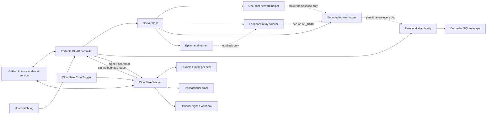

# Portable GHAR Platform Design

<!-- markdownlint-disable MD013 -->

- **Status:** Phase 2 source implementation complete; deferred Linux/Docker operational evidence, forced-runner-version-bump evidence, host sizing, external failover, migration, and live activation remain gated. No host activation is authorized.
- **Repository:** `portable-ghar`
- **License:** MPL-2.0
- **Primary audience:** Operators running ephemeral GitHub Actions workloads on a Linux Docker host, with QNAP/QTS as the first reference host

## 1. Decision summary

Portable GHAR is a public, portable control plane for ephemeral GitHub Actions runners on a Linux Docker host.

The first implementation will:

- use the public-preview `actions/scaleset` Go client behind a pinned internal adapter;
- launch one fresh runner container per assigned job;
- require scale-set `RunnerSetting.DisableUpdate=true` and manage runner releases through an external immutable candidate pipeline rather than in-place self-update;
- keep Docker control, GitHub App credentials, and notification credentials outside job containers;
- install and verify a unique egress jail before each runner listener starts;
- use a host-level watchdog for local recovery;
- use an external Cloudflare Worker and one Durable Object per fleet as the sole automatic failover authority;
- use one Cloudflare Cron Trigger as the sole durable due-work scheduler;
- issue one short-lived, signed acquisition lease to the active fleet holder
  rather than creating remote authority records for each poll, acquire, or JIT
  operation;
- send transactional email as the primary notification and an optional signed webhook as the secondary notification;
- keep all deployment-specific configuration and secrets outside the public repository; and
- keep public-repository CI on GitHub-hosted runners so the project never tests its own runner controller with untrusted pull-request code.

This project is not an official GitHub project. Its scale-set integration depends on a public-preview upstream interface and must be presented as experimental until the compatibility and migration gates in this document pass.

### 1.1 Standalone dependency boundary

Portable GHAR source, builds, tests, release artifacts, deployment tools, and
runtime depend only on this repository and its declared public dependencies.
No consumer repository, collaboration broker, reviewer plugin, or developer
workspace is a product dependency. Independent review tooling is replaceable
development infrastructure, and deployment-time consumer workflows remain
external integrations chosen from authenticated live inventory. Failure or
absence of either cannot create a new Portable GHAR build, test, release, or
runtime prerequisite.

### 1.2 Engineering baseline

Correctness, security, operational reliability, practical simplicity, and
elegant design are co-equal acceptance criteria. A change that meets one by
making another brittle is not acceptable. These rules are normative for every
remaining phase and review:

1. **Bound every dependency.** Every network call, datastore operation, lock,
   subprocess, scheduler action, and long-lived worker has an enforceable
   timeout, backpressure limit, or explicit lifecycle owner. A deadline check
   before an unbounded call is not a bound.
2. **Define safe degradation.** Timeout, error, unavailability, partial
   success, crash, cold state, stale state, concurrency, and misconfiguration
   each have a named safe outcome. Security and authority failures fail closed;
   availability may degrade to queued GitHub work while hosted remains the safe
   route.
3. **Never report false success.** Persistent or external effects are
   idempotent or safely re-entrant, ambiguities reconcile through authoritative
   read-back, and cleanup is positively proved. A successful API response is
   not proof that the intended state exists.
4. **Bound growth and retry.** Memory, disk, tmpfs, processes, file descriptors,
   queues, history, retries, and evidence retention have explicit ceilings.
   There is no unbounded retry cascade or maintenance requirement that depends
   on periodic manual cleanup.
5. **Prefer one authority and proven primitives.** Each decision has one
   authoritative writer. Use documented platform contracts before custom
   coordination, and stop rather than depend on private runtime internals.
6. **Make complexity earn its place.** Every component, state, endpoint, table,
   credential, and transition must enforce a current requirement that a simpler
   design cannot meet. Counts are review outcomes, not quotas; speculative
   extensibility is prohibited.
7. **Preserve edit locality.** Each unit has one clear responsibility and a
   closed interface. Keep one lifecycle engine and one phase table; partition
   implementation by operation family when a file can no longer be safely
   reasoned about as one unit. Do not add a parallel engine or authority layer.
8. **Test the failure contract.** Tests cover the happy path, timeout,
   cancellation, crash/re-entry, partial effect, stale identity, combined
   failure, resource exhaustion, and rollback. Production claims require live
   evidence on the platform whose behavior they describe.

The security-motivated runner/relay/parser/dialer/helper/verifier split and the
SQLite single-writer/full-synchronous store satisfy this baseline: their visible
boundaries remove privilege and race classes. They must not be collapsed merely
to reduce component count. Conversely, presentation, notification, and review
transport are never promoted into routing or acquisition authority.

## 2. Goals

1. Replace fixed, always-online runner slots with on-demand ephemeral runners.
2. Preserve one-job/one-environment semantics and destroy job state after completion.
3. Keep untrusted workflow code away from the Docker socket, host filesystems, devices, and control-plane credentials.
4. Fail closed when the runner egress policy cannot be installed or verified.
5. Route work to GitHub-hosted runners when the local fleet is unhealthy.
6. Keep failover authority outside the Docker host and its local network.
7. Support multiple repositories with a fleet-wide capacity ceiling and starvation-resistant admission.
8. Make the implementation portable across Linux Docker hosts through narrow host-adapter interfaces.
9. Make the public repository safe to fork, inspect, build, and contribute to without exposing an operator's identity, topology, or deployment state.
10. Produce reproducible binaries and images with checksums, SBOMs, provenance, and third-party license notices.
11. Survive GitHub-forced runner version bumps without manual intervention or loss of the GitHub-hosted execution path.
12. Reclaim every job-scoped cgroup, tmpfs, process, namespace, and workspace by whole-container destruction, with bounded steady-state host memory and no persistent runner work area.
13. Keep every mandatory source and operational contract consumer-neutral so the platform can be built, tested, deployed, and operated without any unrelated repository or development tool.

## 3. Non-goals

- Kubernetes, Actions Runner Controller, or Kubernetes runner hooks.
- Job containers or service containers orchestrated by the runner.
- Docker-in-Docker or access to a host Docker socket from a job.
- VM-grade isolation.
- Hosting secret-bearing deployment, release, or automation jobs merely because self-hosted capacity exists.
- Supporting arbitrary QTS releases, kernels, CPU architectures, or Docker builds without a verified host profile.
- Guaranteeing that automated scanners can prove the absence of every identifying value.
- Providing a hosted Portable GHAR control-plane service.
- Keeping a serving runner container current by deleting old-version files or updater staging in place.

## 4. Trust model

### 4.1 Trusted components

- The host operating system and Docker daemon.
- The Portable GHAR controller and its private runtime state.
- The host watchdog.
- The network-policy helper and verifier images.
- The Cloudflare Worker, Durable Object, and configured bindings.
- The controller and failover GitHub Apps.
- The operator's private deployment overlay and secret stores.

Docker control is host-root-equivalent. The controller is therefore a trusted host process even when its Unix account is not UID 0.

### 4.2 Untrusted components

- Repository contents checked out for a job.
- Pull-request code, scripts, build tools, and dependencies.
- Action implementations downloaded for a job.
- Job output, artifacts, and values derived from the job workspace.
- Contributions and issue content submitted to the public repository.

The runner worktree is never promoted into the control plane. Control-plane code does not import, source, execute, or inspect job-owned configuration beyond narrowly defined result metadata.

### 4.3 Bounded job credentials

The JIT runner configuration is secret and is never logged, placed in Docker
container configuration, or persisted outside controller memory and the
ephemeral runner process.

The upstream runner accepts JIT configuration through `ACTIONS_RUNNER_INPUT_JITCONFIG`, masks it, and removes it from the listener process environment during startup. Docker host metadata and runner configuration files remain inside the trusted-host/ephemeral-container boundary, so the design does not claim that a malicious job can never observe its own one-job runner credentials. The mitigation is scope and lifetime:

- one JIT configuration per runner and per job;
- no reusable controller GitHub App key in the container;
- no host Docker access;
- no cross-job runner reuse; and
- immediate container destruction and credential invalidation after completion or error.

Docker `--env`, `--env-file`, labels, command arguments, bind mounts, named
volumes, and Docker config/secret objects are prohibited for JIT transport.
The controller retains the JIT bytes in owned memory until the network barrier
passes. Both frames reach the runner's one long-lived held gate process over a
single runner-private tmpfs `AF_UNIX` socket the gate owns (mode `0600`): the
controller delivers each frame by invoking a minimal `docker exec -i` forwarder
that copies its stdin — the exact frame — into that socket and exits, holding no
secret state, so only the subcommand name is recorded in Docker exec metadata.
The readiness token is 32 cryptographically random bytes and is never persisted;
the gate holds only its SHA-256 digest, in process memory, never in a file. Both stdin protocols
use fixed binary frames with an eight-byte ASCII magic, version `1`,
big-endian lengths, and exact EOF. The arm frame is
`PGHARARM | version:u8 | algorithm:u8=1 | digestLength:u16=32 | digest:32`.
The release frame is
`PGHARREL | version:u8 | tokenLength:u16=32 | jitLength:u32 | token | jit`,
where `jitLength` is nonzero and at most 65,536 bytes. Unknown versions or
algorithms, duplicate/re-arm attempts, truncation, premature EOF, trailing
bytes, invalid lengths, and frames over the total bound fail closed and destroy
the runner. Frames are parsed at fixed offsets driven by the declared lengths;
scanning the stream for magic bytes is prohibited, because the opaque JIT
payload may legally contain frame-magic byte sequences. Gate reads enforce a
bounded read deadline: a stalled or partial frame past the deadline fails
closed and destroys the runner. Arm/consume state is process-local to the one
held gate and never persisted; any gate restart or state ambiguity destroys
the runner rather than re-arming.

The held gate constant-time verifies the previously armed digest against the
released token, atomically consumes its in-memory arm state, removes the socket,
and places the JIT value only in the listener child's process environment
immediately before `exec`. The release frame transits the tmpfs socket as
kernel-buffered bytes and is never written as a file. The pinned
upstream listener removes that environment variable during argument parsing
before any job process starts, while its immutable in-process
argument/configuration data remains inside the accepted one-job listener trust
boundary. Tests inspect Docker container/exec metadata, the host-side Docker
state directory in an isolated test daemon, runner-private tmpfs,
listener/job environments, logs, and diagnostics for the adversarial JIT
corpus. Environment-absence assertions begin only after upstream argument
parsing completes and before the first job process is created; the bootstrap
environment before that observation point intentionally carries the JIT.
Tests do not claim Go or .NET heap erasure of prior immutable string copies.

## 5. Architecture



There is no inbound route to the Docker host. The host initiates heartbeat traffic over HTTPS. The Worker is the only automatic writer of workflow routing state.

## 6. Controller design

### 6.1 Internal boundaries

The controller is divided into replaceable units:

| Unit | Responsibility |
| --- | --- |
| Scale-set adapter | Wrap the pinned `actions/scaleset` client and translate upstream types into internal types. |
| Assignment reconciler | Recover assigned jobs after restart and make each transition idempotent. |
| Capacity broker | Enforce a fleet-wide ceiling and fair admission between repositories. |
| Runner lifecycle | Create, release, monitor, and destroy one runner per job. |
| Network jail | Orchestrate the empty runner namespace, adapter, bounded broker, one-shot broker-policy helper, independent verifier, budget, and release barrier. |
| Host runtime | Execute a narrow Docker/host command interface without exposing it to jobs. |
| State store | Persist controller job state, outbox records, and reconciliation metadata in a private SQLite database. |
| Health publisher | Emit a heartbeat only after a complete successful reconciliation cycle. |
| Redacting logger | Emit schema-defined fields and reject secret-bearing or job-controlled fields. |

Upstream scale-set structures do not cross the adapter boundary. Compatibility fixtures, startup probes, and contract tests must detect upstream drift before acquisition is enabled.

### 6.2 Capacity and fairness

Capacity is expressed as resource units, not a count of pre-registered runners.

- Each stable capacity slot declares a checked resource vector for its runner,
  adapter, held/running broker, per-slot dial-authority endpoint, job socket
  directory, durable ledger allocation, and serialized helper/verifier peak.
  The vector covers CPU, memory, PIDs, file descriptors, tmpfs, scratch, socket
  state, durable bytes, and inodes. Admission charges the complete steady-state
  sum plus the larger serialized transient peak; if helper and verifier work is
  ever concurrent, it charges both instead.
- A global ceiling applies across every configured repository.
- Each repository may declare an effective-concurrency maximum: a hard per-repository admission cap evaluated independently of its fairness weight. Admission never grants a repository more concurrent slots than its configured maximum even when fleet-wide capacity is free. The sum of per-repository maxima may exceed the fleet-wide ceiling; the ceiling still bounds total concurrency and weighted fairness arbitrates the shared remainder. The fleet-wide ceiling is validated separately against measured host capacity through the host-conformance resource and conntrack budgets; per-repository maxima are configuration, never a host-capacity claim.
- Repository queues use weighted round-robin admission with an aging override so low-volume governance jobs cannot starve behind a high-volume repository.
- The controller never advertises more acquirable capacity than the host broker has reserved.
- Host pressure can reduce available capacity but cannot silently raise it above configured limits.
- Zero idle runner containers is the default.

Runner tmpfs pages are charged to the enclosing memory cgroup. Tmpfs therefore
has its own admission dimension and hard sub-limit, but is not additional free
memory and is not added a second time to the same runner's host-RAM ceiling.
Every host profile must carry one operator-approved sizing tuple covering
`/runner` and `/tmp` tmpfs, runner memory and swap limits, maximum active
concurrency, and upstream release-observation cadence. Configuration validation
uses checked arithmetic and requires:

```text
runner_tmpfs_limit >= p99_runner_tmpfs_used + runner_tmpfs_margin
runner_memory_limit >= p99_runner_cgroup_used + process_margin
runner_tmpfs_limit + runner_other_tmpfs_limits + process_margin <= runner_memory_limit
max_active * runner_memory_limit
  + max_active * auxiliary_slot_memory
  + idle_controller_and_watchdog
  + candidate_build_and_smoke_peak
  + host_and_gateway_reserve
  <= usable_host_memory
```

Swap is a bounded degradation buffer and does not increase
`usable_host_memory`. The RhoNAS incident supplies regression anchors, not
defaults: 666 MiB idle `/runner` use, 2,162 MiB peak `/runner` use for one real
post-fix job, a 32 GiB host, and six legacy slots. A 2 GiB runner memory limit
cannot contain that measured `/runner` peak and is invalid regardless of a
larger tmpfs mount. The temporary 5 GiB `/runner`, 4 GiB memory, and 6 GiB swap
legacy accommodation is retained only as a migration bridge; Portable GHAR
selects final values from representative p99 distributions and headroom rather
than carrying the emergency high-water limits forward.

Acquisition policy is persisted as `{mode, eligibleScaleSets, maxCapacity, repositoryPolicyRevision, repositoryPolicies, epoch}`, where `repositoryPolicies` is the per-repository `{alias, maxConcurrency, eligibilityState}` set and `repositoryPolicyRevision` is a monotonic counter bumped on any operator-recorded change to that set, including a recorded eligibility-state change. The Worker's live archival latch is separate restrictive lease data and does not change this local revision on its own. Every effective mode, locally recorded eligibility, capacity, or repository-policy change uses one compare-and-set barrier. The barrier closes acquisition first; while closed it admits no new acquisition critical section, heartbeat lease installation, or cached-lease use. It then atomically increments the epoch and discards cached lease authority, cancels and joins every older critical section, and reopens only after all have joined. Persisting the new epoch alone never makes it effective acquisition authority. If an old operation ignores cancellation past the bounded shutdown deadline, the transition owner persists `fatal` with zero capacity and terminates its process; lifecycle tooling treats that transition as failed and proves process/runner quiescence before any fence handoff or restart. A crash during the barrier restarts at the new epoch with no cached authority and must obtain a fresh matching lease.

The public acquisition-policy digest is SHA-256 over exact UTF-8 bytes:
`portable-ghar-acquisition-policy-v1\n`, lowercase mode plus `\n`, base-10
`maxCapacity` with no leading zero plus `\n`, base-10 `repositoryPolicyRevision`
plus `\n`, then each exact eligible scale-set name in unsigned UTF-8 byte order
each followed by `\n`, then a `--\n` separator, then each repository policy as
`alias`, base-10 `maxConcurrency`, and eligibility state (`active`,
`archived-disabled`, or `pending-reactivation`) joined by `\t` and followed by
`\n`, in unsigned UTF-8 alias byte order. The scalar-name and alias grammar
exclude tab and newline. An empty scale-set or repository set contributes no
lines for that section; every fixed line still ends in LF. Only the digest,
policy epoch, repository-policy revision, and capacity enter health.

Every nonzero poll, acquire, or JIT operation enters the existing epoch-bound
acquisition critical section, acquires a current `portable` host-fleet guard,
and validates one cached signed acquisition lease before the external effect.
The lease binds the fleet, exclusive holder (`portable` or governed `legacy`),
server enrollment epoch/session, lease generation, allowed acquisition mode,
exact policy digest/repository-policy revision, the authenticated local
acquisition-policy epoch reported by that heartbeat, maximum capacity, a
canonical bounded `archivedDisabledAliases` set of Worker-latched repository
aliases, and a short server-owned lifetime. The client records a monotonic
timestamp before sending the heartbeat and derives its local deadline from that
timestamp, the server-owned duration, and the approved shortening margin. A
response received at or after that deadline grants no lease, so request
processing and return latency can only shorten local authority; client wall
time never extends it. Lease installation re-enters the open epoch barrier and
atomically replaces the cache only when the heartbeat snapshot, signed lease,
and current persisted epoch/digest all match and the local deadline remains
live. Every cache use repeats that authenticated epoch comparison, closing an
enabled-to-disabled-to-enabled ABA even when every other policy field returns
to the same value.

The operation snapshots that cached lease identity and its monotonic local
deadline `D_lease`. On the same monotonic clock, checked arithmetic sets
`D_cancel = min(now + T_call, D_lease - M)`, where `T_call` is the configured
operation duration and the existing positive forced-termination tail `M` is
partitioned into bounded cancel/join, durable-fatal-write, and termination
slices ending strictly before `D_lease`. Equality, overflow, a missing slice,
or insufficient slack rejects before the external effect. The exact
`D_cancel` bounds the local proof, context, transport, result validation, and
non-authorizing durable preparation; target conformance must prove those calls
honor cancellation and the complete tail.

One per-operation mutex serializes that deadline handler with a two-way
in-memory completion token (`active -> admitted` or `active -> dropped`). While
holding the mutex, the deadline handler cancels only when the token is still
active; after admission or drop it is a no-op. The normal path may persist only
the existing non-authorizing assignment/journal preparation, then re-enters a
short barrier-protected commit and, under the same mutex, changes to `admitted`
only when the context is not cancelled, monotonic time is still strictly before
`D_cancel`, the epoch and cached-lease identity still match, and validation and
preparation completed. Admission disarms the deadline handler before releasing
the mutex; only admission may Ack or release a runner. If cancellation joins
inside `M`, the handler marks an active token dropped and zeroizes the result.
If it does not join, the handler persists fatal/zero capacity and terminates
only while the barrier still names its epoch; otherwise the policy-transition
owner waiting on that registered critical section owns the fatal path. An
ambiguous upstream effect remains in the existing idempotent assignment journal
for read-back/reconciliation but cannot release a runner from a dropped result.
The existing `AcquisitionPermitProvider` interface derives the operation proof
locally from the cached lease and creates no remote per-operation state.

The Durable Object renews a lease only in the signed response to an accepted
heartbeat whose health, active holder, fence generation, policy digest, and
capacity match its current routing state. `canary-only` binds exactly one
persisted canary scale set and one capacity unit. After a Portable canary
succeeds, a newer same-session heartbeat may prove enabled intent, the expected
policy digest, and full capacity as route-readiness evidence while routing is
still hosted, but its response grants no enabled lease. The local change from
`canary-only` to enabled intent crosses the existing acquisition epoch barrier,
so the cached canary lease no longer matches and authorizes no further
acquisition. Only after the Worker creates and reads back self-hosted routing and
enters `PORTABLE` may a subsequent matching heartbeat return an enabled lease. A
local CLI transition,
administrative status result, stale heartbeat response, or maintenance
directive is intent/evidence only and grants no acquisition authority.
Worker unavailability therefore expires the local lease and stops new
acquisition. Work may remain queued on a self-hosted route until the Worker and
its scheduler recover; the system never converts that availability loss into
unbounded local authority.

A replacement enrollment invalidates the predecessor session immediately but
does not erase a lease that predecessor already cached. In the same atomic
transaction, the Durable Object therefore carries forward a server-owned
`leaseNotBefore` restriction through the fleet-global maximum server expiry of
every issued lease plus the same fixed, positive clock/termination safety
margin used for hosted transitions. Until that instant, accepted heartbeats
from the new session return an explicit no-lease result. The predecessor's
send-anchored local authority is strictly shorter than its server expiry; the
margin additionally covers the bounded local epoch-barrier teardown and
termination residual. This uses the existing fleet row and lease protocol
rather than brittle controller-to-controller quiescence; the closed arithmetic
and transaction rules are in §9.2-§9.3.

Let `H` be the maximum configured interval between heartbeat-attempt starts,
`D` the enforced end-to-end heartbeat deadline, `S` the local shortening
margin, `L` the server-owned lease duration, and `N` the operator-approved
number of wholly lost renewal attempts the lease must tolerate. Configuration
is valid only when `N >= 1` and `L > (N + 1) * H + D + S`. Source defines this
inequality but supplies no numeric default. It preserves bounded authority
during Worker loss while ensuring one dropped renewal does not unnecessarily
zero a healthy fleet.

Before a hosted transition, the Durable Object increments the lease generation
and stops renewal. It waits through `lastIssuedLeaseExpiryMax` plus the same
fixed, positive clock/termination safety margin before persisting hosted
mutation work. The send-anchored local deadline above already accounts for heartbeat request and
response latency and is always earlier than that server expiry. It does
not need a close message from every poll or JIT operation. The local epoch
barrier still cancels and joins prior operations; an unjoinable call persists
fatal/zero capacity and terminates the controller before the server margin can
elapse. The same lease type authorizes the fenced legacy holder during governed
rollback, so Portable and legacy do not have parallel authority protocols.

An expired lease is necessary but not sufficient for mutual exclusion, because
a runner past `RUNNER_HELD` — in `RELEASE_ARMED` or `LISTENER_RELEASED` but not
yet `JOB_RUNNING` — holds a released listener that can still accept an
assignment while carrying no live acquisition lease. Listener authority is
therefore bound to the acquisition epoch, fleet-fence generation, lease
enrollment session/generation, and send-anchored local lease deadline under
which the runner was released. When the epoch barrier revokes acquisition
(operator mode change, host pressure, watchdog stop, hosted hold, an
operator-recorded archival policy revision, or failover),
the controller terminates, as part of that drain, every runner past
`RUNNER_HELD` that has not reached `JOB_RUNNING`; runners already in
`JOB_RUNNING` drain normally. Quiescence attestation is required only for transitions that must exclude live
Portable listeners — a governed legacy rollback and an administrative hold or
upgrade drain, where the controller is alive by construction: the controller
publishes the count of un-assigned released listeners, and the Worker does not
complete such a transition until the last lease has expired and it has observed
a fresh heartbeat from the exact enrollment session and lease generation whose
listener set is being drained, reporting zero un-assigned released listeners
for that same generation. A `predecessor-lease-draining` heartbeat from a
replacement session cannot satisfy this proof. If the drained session is
superseded before it reports zero, a governed legacy rollback, administrative
hold, or upgrade drain does not complete from replacement evidence; it remains
incomplete under hosted-safe routing and alerts. A failover to hosted triggered
by staleness or an authenticated fatal state does not wait for that heartbeat —
the host may be down and unable to send one, its per-job containers die with it,
hosted routing does not conflict with any straggler in-flight Portable job
beyond the existing queue-risk envelope, and the fence prevents a returning
zombie controller from acquiring anew. In every case, a released listener
revalidates all four bindings at job-accept time and destroys itself rather than
accepting work when the local lease deadline is reached or any epoch, fence,
session, or generation is superseded. Thus a listener released by a predecessor
session cannot accept a new assignment at or after that predecessor's local
authority expires, even if the old controller process remains alive.

Repository archival is a per-repository eligibility change, not a fleet
failover. Each repository carries a latched eligibility state — `active`,
`archived-disabled`, or `pending-reactivation`. The Worker is the sole live
reader of GitHub `archived` state (it alone holds Metadata read); it observes
archival through an operator-approved bounded integrity sweep. Each repository
record persists the last successful archive observation and its Worker receipt
time. Let `A` be the separately approved maximum age of that evidence,
including sweep cadence, bounded GitHub-call time, and delivery jitter. A lease
response treats `archived=true`, missing evidence, or evidence older than `A`
as restrictive for that alias; a failed or late metadata read never refreshes
the evidence age.

On observing `archived=true` the Worker latches that repository to
`archived-disabled` in the per-fleet Durable Object. Every later lease includes
the exact sorted set of latched or evidence-stale disabled aliases,
authenticated as part of the lease, even if the controller's configuration
revision still lists an alias as active. The set is bounded by the configured
repository inventory, contains no duplicates or unknown aliases, can only
remove authority, and is validated before every local acquisition. The Worker
cannot asynchronously erase a lease already cached on an outbound-only
controller. Authority therefore converges no later than the earlier of the next
accepted heartbeat carrying the restriction or that lease's shorter local
deadline. From a GitHub archive change immediately after fresh evidence, the
worst-case bound is `A` plus the maximum remaining local lease lifetime. If
Worker, Cron, or GitHub metadata service is unavailable, evidence becomes stale
and no later response can renew that alias; the current lease still expires.
This bounded propagation window is an explicit residual, not an instantaneous
revocation claim or a reason to add push delivery or per-acquisition remote
calls.

The next operator-approved repository-policy revision must also record the
alias as `archived-disabled`, which forces zero effective capacity. This
per-repository disable inserts no fleet-wide queue-risk record and never blocks
acquisition for other repositories. A job already running, or acquired under a
still-current pre-restriction lease before the convergence point, drains
normally and is recorded; no acquisition beginning at or after that point is
admitted. The
eligibility state is durable and latched: a later live `archived=false` does
not return the repository to `active` on its own. Reactivation is a distinct
operator-driven path (`archived-disabled` → `pending-reactivation` → `active`)
requiring an operator-approved configuration revision, a fresh workflow and
security eligibility audit, hosted bootstrap and read-back, per-repository
queue-risk clearance, and a current-epoch canary. Live GitHub archive state
always wins over configuration for the disable direction: a stale private
overlay that still lists an archived repository as active never re-enables it,
and only the operator reactivation path — never a bare live `archived=false` —
clears the latch.

### 6.3 Controller job state

Each assignment has a persisted state machine:

```text
RECEIVED
  -> CAPACITY_RESERVED
  -> ADAPTER_CREATED
  -> ADAPTER_VERIFIED
  -> BROKER_HELD
  -> BROKER_POLICY_APPLIED
  -> DIAL_AUTHORITY_READY
  -> BROKER_RELEASED
  -> EGRESS_VERIFIED
  -> RUNNER_HELD
  -> RELEASE_ARMED
  -> LISTENER_RELEASED
  -> JOB_RUNNING
  -> JOB_FINISHED
  -> DESTROYED
```

These checkpoints follow the real external-effect order and persist the adapter,
held broker namespace-owner, runner, stable capacity-slot, policy, socket, and
verification identities needed for restart reconciliation. Any error before
`LISTENER_RELEASED` destroys every per-job component without accepting work.
Any error after release records the ambiguity, stops new acquisition when
necessary, reads back GitHub and Docker state, and reconciles to one terminal
outcome. Repeating a transition must be a no-op or complete the interrupted
transition; it must never launch a duplicate component or runner for the same
assignment.

### 6.4 Safe upgrades

An upgrade proceeds through:

1. enable the authenticated Worker-owned hosted hold and read back every configured repository on hosted runners;
2. stop new acquisition;
3. drain or cancel assigned jobs according to explicit policy;
4. prove zero listeners, adapters, held/running brokers, helpers, verifiers,
   per-job socket directories, and broker dials; stable slot ledgers remain
   retained and unavailable for reuse until their measured `T` expires;
5. replace the pinned controller binary and images;
6. run compatibility and host-profile probes;
7. start the replacement disabled;
8. clear every open queue-risk record through authenticated same-transition GitHub
   read-back and selective recovery while local acquisition remains zero;
9. set canary-only intent, release the hosted hold into a new recovery epoch,
   receive one canary-only lease inside the local epoch barrier, and run the
   secretless canary while routing remains hosted;
10. enable full acquisition intent locally and, while the Worker transition
    epoch is unchanged, observe a
    same-enrollment-session heartbeat whose sequence is newer than the canary,
    reporting `enabled`, the expected policy digest, and complete capacity as
    route-readiness evidence, without issuing an enabled lease; and
11. restore and read back self-hosted routing, enter `PORTABLE`, then require a
    subsequent matching heartbeat and fresh enabled lease before local
    acquisition begins.

Host lifecycle changes use a durable operation journal with an idempotent operation ID and phase. A rerun resumes or compensates forward. Fence generations never decrement and raw fence snapshots are never restored. An upstream compatibility failure leaves acquisition disabled and hosted routing unchanged. The prior immutable image remains retained as a rollback artifact, but the controller never selects an old runner image after its compatibility probe fails; in that case rollback restores the control plane while work remains hosted.

### 6.5 Runner release lifecycle and reclamation

The 2026-07-22 RhoNAS failure is a mandatory regression. A container copied
runner `2.335.1` into a 3 GiB RAM-backed `/runner`, GitHub required `2.336.0`,
and the listener self-updated in place. Both runner payloads plus a 666 MiB
`_work/_update` staging tree exhausted the tmpfs when job work arrived. The
`pull_request_target`/`pull_request` asymmetry and annotation-only ENOSPC signal
are classified as runner-state evidence, not workflow-content evidence.

Portable GHAR prevents recurrence with four layers:

1. The scale-set compatibility probe requires exactly one configured label and
   `RunnerSetting.DisableUpdate=true`. False, absent, unknown, or drifted
   settings force zero acquisition.
2. A scheduled default-branch observer checks the official runner release
   source at the operator-approved cadence. It validates a monotonic tag and
   immutable tag/ref, the unique Linux x64 asset name and size, the official
   SHA-256 asset digest, and publication time. It creates no candidate for
   incomplete, ambiguous, downgraded, or mismatched metadata.
3. A trusted GitHub-hosted release workflow builds one exact-version immutable
   candidate image, verifies `Runner.Listener --version`, rejects a second
   runner payload or `_work/_update` residue, runs compatibility and
   reclamation tests, and publishes a signed manifest, image digest, SBOM,
   checksum, and provenance. Pull-request code and deployment secrets never
   enter this workflow.
4. The target observes only attested candidates. It preserves the selected and
   prior immutable digests and publishes candidate state. The Worker enters its
   hosted hold and exposes a read-only, short-lived, signed outbound
   maintenance directive. Only `stage-permitted` after hosted read-back,
   lease expiry, queue clearance, and zero assigned jobs authorizes local
   acquisition disable plus bounded candidate staging/qualification. Only a
   later `replace-permitted`, after the exact candidate-qualified tuple is
   persisted, authorizes quiescence and digest selection; later
   `canary-permitted` and `enable-permitted` directives authorize the matching
   local acquisition-policy transitions.
   Each directive is bound to active enrollment/transition/lease/config
   generations, the exact status-request control sequence and selected/
   candidate manifest digests, the qualified tuple, policy digests, and server
   expiry, and is re-fetched immediately before use. Pending, rejected,
   interrupted, directive-unavailable, or GitHub-incompatible candidates leave
   work hosted and the previous artifacts available. The journal resumes this
   sequence after a crash or re-enrollment without operator intervention.
   An existing operator-created hold strictly dominates runner-upgrade state:
   release observations and lease expiry persist, but the reason cannot change,
   every directive remains `wait-hosted`, and no stage/select/auto-release
   occurs. After authenticated operator release, only a fresh non-current
   heartbeat may enter a new runner-upgrade hold.

Portable GHAR does not rely on updater-file deletion inside a serving runner.
After every success, cancellation, launch failure, ambiguous assignment,
controller restart, or upgrade interruption, reclamation removes the whole
container and positively verifies absence of its cgroup, `/runner`, `/tmp`,
`_work`, `_work/_update`, descendants, and namespaces within the cleanup SLO.
The default runner work area is bounded tmpfs. A disk-backed alternative needs
separate review and must be an anonymous, size-bounded, one-container
filesystem destroyed with that container; a reusable or unbounded NAS work
path is unsupported. Immutable candidate and rollback images are bounded
release artifacts under the storage-pressure contract, not job workspaces.

On QTS, the normal path pulls the prebuilt attested image. A local fallback
must not invoke `docker build` as the non-admin account: it runs as
administrator or uses the separately qualified run/exec/commit recovery
procedure rooted in the retained rollback image. The listener version and
image digest are smoke-tested before selection. Portable GHAR itself has zero
registered idle runners; migration tooling removes legacy idle containers
(defined by absence of `Runner.Worker`) before an old-image registration can
accept another job.

## 7. Per-job isolation

### 7.1 Runner sandbox

Every runner uses:

- a fresh container and work directory;
- no bind mounts or named volumes containing host data;
- no Docker socket;
- no devices;
- a read-only root filesystem;
- bounded executable tmpfs mounts only where required;
- CPU, memory, PID, and scratch-space limits;
- all Linux capabilities dropped;
- `no-new-privileges`;
- a restrictive seccomp profile;
- denial of unprivileged user-namespace creation;
- seccomp denial of `unshare`, `setns`, `clone3`, `bpf`, raw-packet sockets,
  and `clone` whenever any namespace-creation flag is present; masked,
  read-only `/proc/sys`;
- non-root execution when the verified host profile supports it; and
- no automatic restart policy.

A runner image contains one smoke-tested runner release, and its scale set
disables in-place update. The runner has no persistent host work mount. Runner
completion is not acknowledged as reclaimed until container, cgroup, tmpfs,
workspace/update staging, processes, and namespaces are positively absent.

A capability-less root profile may exist only as a named degraded profile when a host's filesystem behavior prevents non-root execution. It is never selected automatically, and its use must be visible in health and audit output.

### 7.2 Network setup barrier

The runner starts in a held entrypoint — the long-lived gate — that cannot
launch the listener until the controller arms only a one-use readiness-token
digest in the gate's process memory and later releases the raw token plus JIT
over the gate's private tmpfs socket through the exec-stdin forwarder (§4.3).
The digest, raw token, and JIT are never written to a file. Every runner namespace is owned by a dedicated per-job
adapter sidecar, so Docker does not perform a second network setup when the
runner joins it. The host profile selects one explicit egress mode:

- `restricted-broker-v1` is the QTS reference and portable default. The runner
  shares a trusted adapter sidecar's Docker `none` namespace, which has loopback
  only, registers no iptables table or conntrack hook, and has no routable
  interface. The adapter listens only on loopback and byte-relays one TCP client
  connection to one AF_UNIX broker stream; it does not parse or dial.
  HTTP CONNECT is required, and optional SOCKS5 CONNECT may be enabled; SOCKS
  BIND/UDP ASSOCIATE, direct UDP/ICMP/IP, plaintext HTTP proxying, and non-proxy-
  aware protocols are unsupported. The adapter alone receives a read-only bind
  of its per-job broker parent directory; the runner has no mount. That
  directory is mode `0700` and its one socket is mode `0600`, owned by the same
  dedicated non-runner UID in adapter and broker containers. Broker state uses
  a different mount that the adapter cannot see. A separate per-job,
  capability-less broker occupies an independently jailed namespace and is
  itself split into two processes with disjoint authority: a parser process
  that reads the untrusted CONNECT/SOCKS bytes and creates no network socket
  (seccomp denies `socket(AF_INET/AF_INET6)`), and a dialer process that owns
  every real network socket — the DoH connections and the upstream dials — and
  performs no untrusted-stream parsing. The parser hands the dialer only a
  fixed, bounded, already-normalized request struct over an internal socket;
  the dialer independently re-applies the deny classes and consumes a dial
  permit before any `connect()`. Parser compromise therefore cannot create a
  socket, reach a denied destination, or exceed the permit budget.
- `nftables-direct-v1` is optional only on a modern Linux profile that proves an
  exact pre-conntrack admission ceiling before any runner packet can allocate
  shared state. Absence of that proof rejects the profile; there is no filter-
  table approximation or runtime fallback.

For `restricted-broker-v1`, startup is exact:

1. Docker creates and starts the capability-less adapter with `--network none`,
   a read-only root, the read-only per-job broker-directory bind, and no runner,
   JIT, job data, route, or non-loopback device.
2. Conformance proves the namespace exposes no registered iptables tables and
   zero namespace conntrack rows; loopback connection floods must not activate
   conntrack or change the host-global count beyond measured noise.
3. Docker creates and starts the capability-less, non-root, read-only broker in
   held mode on the configured Docker network. That held broker PID is the
   namespace owner but opens no listener, resolver, or upstream socket. A
   NET_ADMIN-only helper joins that exact broker namespace, installs the
   blocked-address/default-drop policy, exits, and is proven gone.
4. While the broker remains held, the controller starts its mode-restricted
   per-slot dial-authority socket, proves the stable slot/job generation and
   durable ledger are current, and checkpoints that identity. The broker sees
   this directory read-only; the adapter and runner cannot see it.
5. The controller releases the same held broker exactly once through the fixed
   host-runtime `ReleaseNetworkBroker` action. No separate anchor image or
   untracked pause process exists. The broker's only writable paths are bounded
   tmpfs plus a mode-restricted per-job relay directory. It has no Docker socket,
   job filesystem, controller credential, shell, or package manager.
6. The controller revalidates the adapter's fixed loopback relay, namespace,
   and exact read-only per-job broker-directory bind. The directory—not the
   socket inode—is mounted so a broker rebind cannot leave a stale inode mount.
   The runner later shares only the adapter network namespace, not its
   PID/mount namespace, host socket mount, or broker namespace.
7. The verifier uses the loopback proxy to prove allowed CONNECT traffic and
   blocked literal/resolved destinations, then proves direct IP, DNS, UDP, ICMP,
   non-proxy TCP, and private routes fail. The broker resolves names only over a
   fixed bounded set of persistent DoH connections, validates every A/AAAA
   result against the complete deny classes, and dials the already validated
   literal address without a second resolver lookup. Broker and verifier scratch
   images contain the same release-locked CA bundle; its source revision,
   SHA-256, license, copied path, and SBOM entry are mandatory. TLS verifies the
   configured DoH server name and fails on a missing, expired, wrong-name, or
   untrusted chain. CA rotation requires a reviewed lock update, rebuilt image
   digests, those negative tests, and target conformance before acquisition.
8. Docker creates the held runner in exact network mode
   `container:<adapter-id>`, with the declared proxy environment and no
   mount or independent endpoint mutation.
9. Input-free audit helpers revalidate both namespace identities, the empty
   runner network, adapter/broker identities, held-broker release generation,
   relay and dial-authority socket mount sources/types/modes, broker filter
   digest, Docker attachments, and conntrack budget; then exit.
10. Only after the final audit has passed and every helper has exited does the
    controller arm the one-use token digest in the gate's memory, then
    immediately deliver the raw token plus in-memory JIT release frame over the
    gate's private tmpfs socket (§4.3). The gate verifies the armed digest and
    starts the listener. No armed state exists before that audit.

The adapter performs only bounded bidirectional byte relay, with hard client/
AF_UNIX FD, buffer, timeout, and concurrency caps. The broker parser identifies
a job by its dedicated Unix listener path, never a client header, and parses
HTTP CONNECT itself; optional SOCKS5 accepts CONNECT only. It bounds the
hostname to 253 bytes and rejects NUL/control/ambiguous authority,
IDNA/IPv4/IPv6 parser disagreement, invalid ports, overlong headers, plaintext
absolute-form HTTP, and unsupported commands. Destination ports are an explicit
host-profile allowlist. On a valid CONNECT the parser emits one fixed-size,
strictly bounded request struct — normalized hostname or literal, and port — to
the dialer over an internal AF_UNIX socket, and never itself opens a network
socket. The dialer treats that struct as untrusted input: it re-validates the
port allowlist, resolves names only over its fixed bounded set of persistent
DoH connections, re-applies the complete deny classes to every A/AAAA answer,
and dials the already-validated literal serially with automatic Happy Eyeballs
disabled. Before every actual kernel `connect()` attempt, including DoH
reconnects and address fallback, the dialer sends one bounded request to the
controller-owned per-slot dial-authority Unix socket and waits for a committed
permit. The controller is the only SQLite writer: it validates the active slot/
job generation, monotonic request sequence, and peer. The dialer's request frame
contains no caller time or refill hint; the authority reads only its injected
trusted monotonic clock, atomically consumes one unit from that slot's durably
reserved block (fsyncing only when it must raise the reservation, not per
permit), then returns a monotonic permit ID. A lost reply or dialer crash wastes
the permit safely; it never refunds or redials without another committed permit.
The runner and adapter cannot see this socket, and the dialer contains
no alternate dial path. Neither component logs destinations or payloads.

The deny classes are a closed, enumerated set applied identically by the
dialer's literal validator and the compiled filter policy, over both parsed
literals and every resolved A/AAAA answer, after normalization. Normalization
folds IPv4-mapped and IPv4-compatible IPv6 (`::ffff:0:0/96`, `::/96`), 6to4
(`2002::/16`) and Teredo (`2001::/32`) embedded IPv4, and alternate IPv4 literal
forms (decimal, octal, hex, and fewer-than-four-part) to their canonical
address before classification; IDNA/UTS-46 with any trailing dot removed governs
name comparison. The denied classes are exactly: (1) this-host and loopback
(`127.0.0.0/8`, `::1`); (2) private and unique-local (`10.0.0.0/8`,
`172.16.0.0/12`, `192.168.0.0/16`, `fc00::/7`); (3) link-local
(`169.254.0.0/16`, `fe80::/10`), including the cloud metadata address
`169.254.169.254`; (4) shared/CGNAT (`100.64.0.0/10`); (5) unspecified,
reserved, documentation, and benchmarking (`0.0.0.0/8`, `192.0.0.0/24`,
`192.0.2.0/24`, `198.51.100.0/24`, `203.0.113.0/24`, `198.18.0.0/15`,
`240.0.0.0/4`, `::`, `2001:db8::/32`); (6) multicast and broadcast
(`224.0.0.0/4`, `255.255.255.255`, `ff00::/8`); (7) the discovered Docker host,
bridge, and management addresses and routes; and (8) anything outside allowed
public unicast space by exclusion. A DNS answer set is accepted only if every
returned A/AAAA record is permitted: a single denied record in an RRset fails
the whole CONNECT closed, with no dialing of a sibling public record and no
partial acceptance. The dialer dials only the exact validated literal and
performs no second resolution between validation and `connect()`.

Parser
fuzzing,
half-close, backpressure, timeout, host-FD/memory exhaustion, slowloris, socket-
replacement/rebind, peer-identity, and confused-deputy tests are release gates.

The apply/audit helpers and untrusted listener never execute concurrently during
startup. A missing helper exit, failed probe, unexpected route/table, held-
broker identity/release mismatch, socket mismatch, policy mismatch, broker/
adapter death, or budget ambiguity
destroys the job environment before listener release. During an active job the
controller periodically repeats the input-free audit and destroys the job plus
safe-stops acquisition on drift. Target-host soak must prove ordinary
Docker/QTS daemons do not mutate either namespace; a hostile root or host daemon
remains outside container-grade isolation.

Network policy is compiled into a profile-aware intermediate policy. There is
no runtime auto-fallback. Both modes implement the same blocked-address classes,
canonical digest, cleanup contract, and positive/negative verification report,
but the support matrix truthfully records that the restricted broker supports
proxy-compatible TCP only while a qualified direct profile may support more.

The QTS broker backend does not trust the host's old `iptables` userspace. Its
digest-pinned one-shot helper uses a digest-pinned build stage and a scratch
final stage containing the exact legacy restore/save binaries, dynamic loader,
transitive shared-library closure, `libxtables`, and complete pinned xtables
extension directory required by the generated grammar. The build records every
copied path and digest in the image SBOM and fails if `lddtree`/`scanelf`
discovers an undeclared dependency. The helper verifies the selected binary
reports the legacy backend and that every required match/target can restore and
read back before acquisition is enabled. Required kernel xtables modules must
already be present and pass the host-profile conformance probe; the helper has
no `CAP_SYS_MODULE`, shell, package manager, or application-network capability
and never broadens host kernel state. Exact helper-userspace/kernel compatibility
is acceptance-tested in the trusted broker namespace on the target profile and
after every QTS update. The
scratch runtime has an exact bounded writable lock contract:
`XTABLES_LOCKFILE=/run/xtables.lock` and a private
`/run` tmpfs mounted `rw,noexec,nosuid,nodev,size=64k,mode=0700`; every other
path remains read-only. Image-closure and target tests use those exact final
run flags and prove the lock file cannot escape that tmpfs.

IPv4 and IPv6 restore operations cannot be one cross-family kernel transaction.
This creates no untrusted escape window because the runner does not yet exist,
the broker remains held and opens no listener or socket, and the trusted helper
is the only process performing network effects in the broker namespace. The
controller destroys both namespaces rather than rolling back if either family
fails. A host profile must select exactly one
broker IPv6 posture: `deny-via-ip6tables`, which requires successful restore/
read-back, or `kernel-disabled`, which requires positive proof of no IPv6
address, route, or enabled broker stack. There is no automatic fallback.

The helper receives `NET_ADMIN` only, exits before the broker/listener starts,
and returns no rule text or route details. Its read-back parser accepts only the
exact grammar emitted by the pinned helper for the complete generated filter
table: `OUTPUT` has default `DROP`, the exact first jump to the dedicated chain,
and no earlier accept/bypass; the dedicated chain matches the normalized graph.
The verifier independently exercises positive and negative CONNECT behavior.
Failure to restore/read back, match the digest, prove IPv6 posture, or block any
prohibited literal and resolved target destroys the environment before release.

Docker NAT consumes host-global conntrack resources. The restricted-broker
profile bounds allocation before it becomes attacker-controlled: the runner can
create no routable packet, and only the trusted broker dialer performs kernel dials.
Conformance measures a conservative `conntrackEntriesPerActualDial` factor that
includes broker-namespace plus host-NAT accounting for successful, refused,
timed-out, and closed dials. Let `O` be the hard simultaneous upstream-socket
cap, `B` the durable dial burst, `R` the maximum actual kernel dials per second,
and `T` the maximum observed post-close/post-crash conntrack tail timeout.
Target crash tests must prove broker FD closure moves every tracked flow out of
established state; if any flow can remain established, `T` becomes that full
established timeout or the profile fails closed. Checked arithmetic is applied
separately to job-tunnel and fixed DoH control classes, then summed:

```text
classConntrackBudget =
  conntrackEntriesPerActualDial * (2 * O + B + ceil(R * T))

runnerConntrackBudget = jobClassBudget + dohControlClassBudget

sum(runnerConntrackBudget) + hostReserveEntries <= nf_conntrack_max
```

The two open-cap terms conservatively cover current sockets plus older sockets
that enter tail state during the current window; recent active sockets may be
double-counted. All budget arithmetic uses unsigned 64-bit integers with
explicit overflow checks; any overflow rejects admission rather than wrapping.
Each class budget is enforced independently and per dial at permit-consumption
time — job dials cannot consume the DoH control-class allocation nor the
reverse, and the budgets are runtime enforcement limits, not merely
admission-time planning inputs. The retained tail window is keyed to the
slot's last attributed dial, not merely its release time, and `T` is
re-derived whenever the re-read kernel timeout observations change. The canonical controller SQLite database is the single writer
for token and monotonic-clock state keyed by stable capacity-slot ID. A private
controller-managed state root exposes one mode-restricted dial-authority socket
per active slot only to that slot's trusted dialer; it never exposes the SQLite
file. The authority durably reserves consumption in bounded blocks rather than
fsyncing every individual permit: it fsyncs a raised per-slot high-water
reservation once per block, then serves permits from memory up to that reserved
mark, so a normal high-rate workload of thousands of dials costs one fsync per
block, not one per `connect()`. Crash recovery treats the entire last durably
reserved block as consumed and never refunds it; because reserved ≥ issued ≥
actually-dialed, recovery can only over-count, which lowers available capacity
safely, and the over-count is reclaimed when the tail window `T` expires. The
ledger is retained across dialer restart, job teardown, slot reuse, and capacity
reduction for at least `T`; a new assignment never receives a fresh bucket. Slot
retirement removes the per-job relay and authority socket directories after
teardown but retains the durable ledger until `T`, after which bounded garbage
collection may delete it only if no assignment or dialer references the slot.
The ledger records the boot identity. Within one boot, monotonic-clock
regression fails closed. A new boot identity together with positive startup
proof that the kernel conntrack table is empty permits one conservative,
journaled rebase to zero consumption for reconstructed slots — safe because the
physical conntrack state the retained ledger accounted for cannot survive the
reboot; the rebase is never reused within a boot, and rollback or in-boot clock
regression still fails closed. Storage headroom accounts for every active and
retained ledger. Every upstream descriptor is
close-on-exec and cannot survive in a child. Consequently all repeated job/crash
generations remain inside the same recent-dial term; hidden parallel dialing is
prohibited. Every change to `nf_conntrack_max`,
timeout inputs, active capacity, or token state recomputes the bound before
acquisition; overflow, missing state, or insufficient reserve safe-stops through
the acquisition epoch barrier. AF_UNIX/client FDs and broker memory have separate
hard caps because they do not consume conntrack but can exhaust the host.

Host health continuously re-reads `nf_conntrack_count`, `nf_conntrack_max`,
timeouts, dial/debt state, and the measured factor. Chaos tests flood loopback
proxy requests, unique destinations, failed dials, broker crashes, and repeated
restart generations; they prove the global count never exceeds the calculated
delta, established-stream bandwidth is not throttled, and acquisition stops
before the reserve is consumed. This is a host-resource guard, not VM isolation.

### 7.3 Egress policy

The QTS default is public-internet-only, proxy-compatible TCP with fixed
persistent public DoH and an explicit destination-port allowlist. It does not
use a domain allowlist because build workloads require diverse public registries
and package services. Direct UDP, ICMP, SSH, arbitrary IP, plaintext HTTP proxy,
and tools that ignore the proxy contract are unsupported until a separately
qualified profile exists.

Host profiles must discover and block their real host, bridge, management, and
local routes at runtime. A static private-range check is insufficient. Tests
cover every blocked class before and after DNS resolution and prove loss or
corruption of runner emptiness, socket identity, broker policy, resolver state,
or budget prevents listener release. Current workflow compatibility is proven
by canary; it is never inferred from a tool's usual proxy behavior.

### 7.4 Residual boundary

All runner containers share the host kernel. A kernel or container-runtime escape can bypass container and network controls. Portable GHAR therefore claims container-grade isolation only. Operators requiring VM-grade or hardware-grade isolation must place the Docker host inside an independently isolated VM or network segment.

## 8. Host watchdog and adapters

### 8.1 Watchdog authority

The local watchdog may:

- restart a missing or failed controller;
- reconcile stale controller PID/lock state;
- verify required private files and modes;
- report local health; and
- stop acquisition when host prerequisites fail.

When `legacy` owns the host-local fence, the watchdog may restart Portable GHAR only as a force-disabled observer with verified zero capacity. Any nonzero advertisement, poll, JIT generation, or acquisition requires a current `portable` guard.

It may not:

- change repository routing;
- mint or store failover GitHub App credentials;
- mark the external state healthy independently of controller reconciliation; or
- run as a Docker container on a host whose Docker daemon it is expected to recover.

The host-local fence uses one stable, never-renamed advisory-lock inode, a separate monotonically replaced generation header, and one renewal record per `{generation,fleet,owner,pid,boot}` holder. Same-fleet controller/watchdog guards may coexist; an exclusive handoff waits for every old-fleet guard to close before incrementing the generation. A holder whose renewal cannot be persisted terminates only its own child.

### 8.2 Host adapters

The first adapters are:

- QTS persistent host watchdog and Docker CLI integration; and
- standard Linux systemd integration.

Host-specific paths, users, group IDs, schedules, resource ceilings, and Docker networks belong to a private deployment overlay. Public examples contain placeholders and schema-valid synthetic values only.

Each host profile declares minimum kernel/runtime capabilities and includes a positive conformance suite. Unsupported profiles fail closed.

### 8.3 Storage-pressure contract

The runtime manifest declares checked, nonzero minimum free-byte and free-inode
reserves for every filesystem containing the Docker root, staged releases,
controller state, rollback material, temporary runner scratch, and logs. The
install calculation includes the simultaneous old release, new release,
temporary extraction, verified rollback reserve, configured maximum concurrent
complete slot vectors, serialized helper/verifier transient peaks, relay and
dial-authority directories, controller-state reserve, every ledger retained
through `T`, bounded log reserve, and host safety margin; shared filesystems are
deduplicated before summing and all arithmetic is overflow-checked. Image staging
or installation stops before the first write if
any byte or inode reserve would be crossed.

Runner job work is never charged to a persistent reusable NAS volume. The
preferred profile uses bounded tmpfs and reclaims it by removing the whole
container. Any separately approved disk-backed fallback is an anonymous,
size-bounded one-container filesystem included in the slot and storage budgets
and positively removed after the job. Immutable current/candidate/rollback
images remain bounded operational artifacts in Docker root; they do not carry
job work and are garbage-collected only after rollback retention permits it.

The controller and watchdog re-read free bytes, free inodes, Docker-root usage,
state/retained-ledger growth, and log growth before acquisition and on every
health cycle.
Crossing a configured warning threshold reduces effective capacity through the
acquisition epoch barrier; crossing the stop threshold safe-stops before a new
poll, acquisition, JIT generation, or listener release. Recovery requires a
sustained healthy window and a complete budget recomputation. Controller and
watchdog logs use exact byte/file-count retention; every per-job Docker
log driver is disabled unless a profile explicitly declares bounded
`max-size`/`max-file` settings. No supported profile permits unbounded logs.

## 9. External failover control plane

### 9.1 Why it is external

A process on the Docker host cannot detect total host, storage, Docker-daemon, power, local-network, or site-uplink failure. The failover writer therefore runs on Cloudflare Workers and does not require inbound access to the host.

### 9.2 Fleet enrollment

The Durable Object owns the fleet epoch. The host does not persist or choose it.
All persisted enrollment timestamps, lease server expiries, and enrollment
boundary comparisons use Worker/Durable Object time; client time is not an
input. Let `R` be the Worker's receipt time for the enrollment, `E` be nullable
`lastIssuedLeaseExpiryMax`, `B` be nullable current `leaseNotBefore`, and `M` be
the fixed positive hosted-transition clock/termination safety margin. `E` is
the fleet-global monotonic maximum server expiry of every lease issued to any
session or holder; it never decreases or clears on lease expiry, session change,
or holder change.

Enrollment and lease-issuing heartbeat mutations serialize on the same
`fleet_state` transaction boundary. If an old-session heartbeat commits first,
enrollment observes its advanced `E`; if enrollment commits first, that
heartbeat is old-session traffic and grants no lease. No interleaving may
commit a lease while omitting it from the new session's drain restriction.

1. A controller instance creates a cryptographically random request nonce and
   sends one canonical `POST /v1/session` request containing the configured
   fleet identifier, nonce, timestamp, and controller build identity. An HMAC
   covers the exact method, path, and body.
2. The Worker enforces a bounded timestamp window and exact request schema. The
   Durable Object atomically rejects a reused nonce digest, records the nonce
   with a bounded expiry, increments the server-owned epoch and lease
   generation, creates a random session identifier, invalidates the prior
   session, computes `candidate = R` when `E` is absent and otherwise checked
   `E + M`, and sets the new session's
   `leaseNotBefore = max(R, B when present, candidate)`. Overflow, an invalid
   timestamp, or an unavailable required value fails closed before changing the
   session. This one assignment means an intervening no-lease session or rapid
   repeated enrollment cannot discard an earlier issued lease's drain.
3. The response is authenticated and binds the request nonce, fleet, new epoch,
   random session identifier, initial heartbeat sequence, lease generation,
   `leaseNotBefore`, and Worker receipt time. The controller verifies the
   complete response before storing the session.

Local controller-state loss causes a new authenticated enrollment rather than
a permanent lockout. Old session traffic is rejected as soon as the newer epoch
is active, but the replacement session receives no acquisition lease before
the current heartbeat's Worker receipt time is at or after `leaseNotBefore`.
Because a correct predecessor's send-anchored local deadline is strictly before
its server expiry, equality at the later `leaseNotBefore` boundary cannot
overlap its local authority. Repeated enrollments carry the maximum restriction
forward and can never shorten the drain. A first enrollment, or a replacement
after the fleet deadline has already passed, is not delayed beyond the normal
heartbeat checks.

The single exchange provides the same replay and stale-session guarantees as a
challenge/complete protocol with one fewer endpoint and half as many failure
boundaries. A future additional round trip requires a demonstrated threat that
the timestamp, nonce, request HMAC, atomic nonce store, and bound response do not
address.

### 9.3 Heartbeats and acquisition leases

A heartbeat is generated only after a successful controller reconciliation and contains allowlisted operational data:

- fleet identifier;
- server-issued epoch and session identifier;
- monotonic session sequence;
- active fleet (`portable`, governed `legacy`, or `none` during a fence
  handoff) and current host-fence generation;
- acquisition state, local acquisition-policy epoch, and the canonical SHA-256
  acquisition-policy digest defined in §6.2, including mode, exact eligible
  scale-set set, maximum capacity, repository-policy revision, and the exact
  repository-policy set;
- available capacity summary;
- assigned-job count, oldest-assignment age, and un-assigned released-listener
  count;
- last terminal job time;
- host-profile identifier and degraded-profile flag; and
- controller build identifier.

The HMAC authenticates the complete payload. Worker receipt time determines freshness. Client time is diagnostic only. Duplicate, reordered, old-epoch, and replayed messages are rejected.

An accepted `POST /v1/heartbeat` returns one authenticated response containing
the accepted sequence, Worker receipt time, current routing transition, a
maintenance directive, and either one `AcquisitionLeaseV1` or an explicit
no-lease result. The lease is the only remote acquisition authority. It binds:

- fleet, holder (`portable` or governed `legacy`), enrollment epoch, and
  session;
- lease generation and allowed mode (`disabled`, `canary-only`, or `enabled`);
- exact acquisition-policy digest, repository-policy revision, and the local
  acquisition-policy epoch accepted from this heartbeat;
- maximum capacity and, for canary-only mode, the one eligible scale set;
- the canonical bounded `archivedDisabledAliases` set of Worker-latched
  repository aliases; and
- a short server-owned validity duration `L` and checked server expiry
  `X = Q + L`, where `Q` is this heartbeat's Worker receipt time.

Before the current session's `leaseNotBefore`, an otherwise accepted heartbeat
returns the closed no-lease reason `predecessor-lease-draining` and records no
new lease expiry. That reason is included in bounded status and audit evidence.
The accepted heartbeat proves controller liveness only; it is not
acquisition-ready health, canary/failback evidence, hosted success, or
zero-listener quiescence evidence, does not change routing, and may leave work
queued on an existing local route for the bounded remainder of the drain. At or
after that same Worker-time boundary, normal routing, holder, health, fence,
policy, and capacity checks determine whether a lease may be issued. A first
enrollment or already-passed boundary adds no delay. A detected Worker-time
anomaly fails closed with no lease and an alert rather than fabricating a
shorter drain.

When the Durable Object decides to return an `AcquisitionLeaseV1`, it computes
checked `X = Q + L` in Worker/Durable Object time. Overflow, an invalid or
regressing `Q`, or a nonpositive `L` fails closed with no lease. The same
transaction that commits the accepted heartbeat and lease decision sets
`lastIssuedLeaseExpiryMax = max(E when present, X)`. The field is fleet-global
across Portable and legacy, never decreases, and is not cleared on expiry or
enrollment. The authenticated response is emitted only after that transaction
commits. Failure before commit grants no lease and advances nothing; failure or
response loss after commit leaves the maximum advanced, so later enrollment
still drains authority the client might have received. A no-lease decision
never advances the field. The restriction is therefore safe after host-state
loss without a positive message from the predecessor process.

The controller records monotonic time before sending the heartbeat and derives
the strictly shorter local deadline from that attempt-start timestamp, the
server duration, and the approved shortening margin. A response received at or
after that deadline grants no lease. The signed disable set must be sorted,
duplicate-free, bounded by, and a subset of the current repository inventory;
every acquisition rejects an alias present in it. The controller never extends
authority from local wall time, a cached status response, or a maintenance
command. Every later heartbeat replaces the prior lease; leases are not
renewed by administrative traffic. A missing, invalid, stale, mismatched, or
expired lease stops new acquisition while already-running jobs drain. This is
the defined safe degradation when the Worker or scheduler is unavailable.

The §6.2 heartbeat/lease inequality is normative for this protocol. A
configuration that cannot tolerate its operator-approved number of wholly lost
renewals while keeping local authority strictly shorter than server authority
is invalid before enrollment.

During a governed rollback, the fenced legacy wrapper uses the same managed
heartbeat client to establish a new server-owned session only after portable
acquisition is quiescent and the fence reads `legacy`. It publishes sanitized
legacy process/registration/egress/job observations but has no routing
credential or writer. The Worker accepts legacy health only when the active
fleet and monotonically increasing fence generation match the authenticated
rollback transition; stale/fatal/mismatched legacy health returns routing to
hosted. The response carries the same bounded lease type used by Portable, so
legacy does not introduce a second authority protocol. This compatibility
publisher replaces no acquisition logic and does not recreate the retired
external watcher.

### 9.4 Durable Object model

One Durable Object is the coordination atom for one fleet. Multiple independent fleets use multiple deterministic objects.

SQLite uses six responsibility-based tables:

- `fleet_state`: active session, heartbeat sequence/time, lease generation,
  fleet-global monotonic `lastIssuedLeaseExpiryMax`, `leaseNotBefore`, holder,
  routing state, hosted hold, configuration revision, policy digest, and
  bounded health counters;
- `request_nonces`: digests and expiries for session and administrative replay
  protection;
- `repositories`: aliases, expected selectors/workflow identities, confirmed
  routes, archive eligibility, and at most one bounded `openQueueRisk` record
  for the latest applicable transition epoch;
- `transitions`: one row per routing transition with its epoch, desired state,
  canary identity/result, and terminal read-back evidence;
- `due_work`: a closed-kind idempotent outbox for GitHub mutation/read-back,
  canary, email, and webhook work, including bounded claim and retry state; and
- `audit_events`: bounded, sanitized decision and effect evidence.

Adding a table requires a new independently owned lifecycle or retention
contract that cannot be represented safely in these six. Table count is an
outcome of responsibilities, not a quota.

Local transition intent and variable-specific outbox records are committed
before external GitHub mutations. Each due row is transactionally claimed with
an expiring claim ID before bounded external I/O; outcome commits require the
same live claim and can confirm only that row. A crash or ambiguous API result
triggers claim recovery, authoritative GitHub read-back, and idempotent
reconciliation. No external routing write occurs from unpersisted intent.

One Cloudflare Cron Trigger is the sole durable due-work scheduler. Because a
Durable Object namespace is not enumerable, the private deployment
configuration carries one exact, canonical, duplicate-free, size-bounded
`fleetIds` inventory and its revision/digest. Each tick validates that inventory
and addresses every listed deterministic fleet object directly through the
Durable Object namespace. Per-fleet calls have enforced deadlines and run under
bounded concurrency; a failure in one fleet is retained and alerted without
preventing attempts for the others. Each addressed object reconciles its
private configuration, evaluates health, and claims a bounded batch ordered by
safety priority and due time. The configured fleet count, per-fleet deadline,
concurrency, Cron period, and platform execution budget must satisfy a checked
operator-approved inequality that permits every listed fleet to be addressed
on each tick; source supplies no numeric defaults.

Session enrollment and lease renewal fail closed for a fleet absent from the
same validated inventory. Adding a fleet requires a revisioned configuration
deployment and positive Cron-addressability read-back before enrollment can
issue authority. Removing one requires hosted confirmation, zero live lease,
empty `due_work`, and terminal retention evidence before the inventory revision
can omit it. The inventory is discovery configuration, not a second state store
or routing authority. A request handler may opportunistically execute work it
just persisted, but recovery never depends on another request. Expired claims
return to the queue on a later cron tick. Retry count, elapsed age, claim
duration, batch size, per-destination concurrency, and retained history are
bounded; a permanent failure stays visible and never becomes false success.

Durable Object alarms, private storage tables, and runtime-specific transaction
coupling are deliberately excluded. They duplicate the scheduler and make
safety depend on undocumented implementation details. A Cron outage delays due
work; paired Worker unavailability also lets the short acquisition lease expire
and stops local acquisition. The last confirmed GitHub route may remain local
and new jobs may queue until the control plane recovers. This availability
residual is explicit and observable; it is safer and simpler than a second
scheduler with different recovery semantics.

When Cron is functioning, the operator-approved hosted-transition completion
budget must cover the remaining interval through `lastIssuedLeaseExpiryMax`,
the hosted safety margin, one Cron period, the platform's bounded delivery
jitter, and one bounded due-work execution/read-back attempt. Exceeding that budget leaves the transition
incomplete and alerts; a Cron outage has no finite completion guarantee and
can never be reported as hosted success. The source defines this inequality
but supplies none of its numeric terms.

Repository additions are accepted only while the hosted hold is active and the private configuration revision increments exactly once with a matching canonical digest. The Durable Object inserts each new repository unconfirmed-hosted, queues one row for each of its route/scale-set/legacy-label variables, reads each back independently, and persists its canary workflow/expected revision before the hold can release. Routine expansion never relies on direct variable writes; identity mutation, revision skip/rollback/digest mismatch, and removal require separate retirement handling.

### 9.5 Failover state machine

```text
UNINITIALIZED (not an authority state) -> HOSTED
HOSTED -> PORTABLE_CANARY -> PORTABLE
PORTABLE_CANARY -> HOSTED
HOSTED -> LEGACY_CANARY   -> LEGACY
LEGACY_CANARY -> HOSTED
PORTABLE -> DRAINING_TO_HOSTED -> HOSTED
LEGACY   -> DRAINING_TO_HOSTED -> HOSTED
```

The six persisted states are deliberately coarse. Canaries, GitHub mutations,
read-backs, lease expiry, queue-risk clearance, and notifications are outcomes
inside a transition, not extra top-level states. A transition row records their
progress idempotently; adding a routing state requires a distinct externally
observable authority configuration, not another implementation checkpoint.
`UNINITIALIZED` is a fail-closed bootstrap condition, not a seventh persisted
authority state: it issues no lease and enters `HOSTED` only after every
configured repository has been read back hosted. A failed or cancelled canary
advances the lease generation, stops canary renewal, and returns directly to
`HOSTED` because routing never left hosted; it does not invent a draining
transition or queue-risk record.

- `HOSTED`: every configured repository is read back hosted and no local lease
  renews.
- `DRAINING_TO_HOSTED`: lease generation has advanced, renewal has stopped, and
  hosted mutation/read-back plus the `lastIssuedLeaseExpiryMax` boundary and
  local listener drain are in progress.
- `PORTABLE_CANARY`: routing remains hosted; one canary-only Portable lease
  authorizes exactly one capacity unit and one persisted canary scale set.
- `PORTABLE`: routing is read back self-hosted and a matching enabled Portable
  lease may authorize bounded acquisition.
- `LEGACY_CANARY`: routing remains hosted; the fenced legacy holder receives
  the same canary-only lease type for its exact canary label.
- `LEGACY`: routing is read back explicit legacy and a matching enabled legacy
  lease may authorize bounded acquisition.

All transitions between Portable and legacy pass through hosted. Unknown,
partially restored, ambiguous, or corrupt state starts in or moves toward
hosted; it never infers a local route.

Default policy:

- one-minute evaluation cadence;
- initial and ambiguous routing remains hosted until GitHub read-back confirms it;
- configurable stale threshold with a six-minute default;
- at least two consecutive unhealthy evaluations before failover;
- immediate failover eligibility for authenticated fatal controller states;
- sustained healthy observations before recovery canary;
- failback only after a canary tied to the active transition epoch and expected
  revision succeeds, local enabled intent and a newer-sequence heartbeat in the
  unchanged Worker transition epoch prove the expected policy digest and
  complete capacity as route-readiness evidence, self-hosted routing is read
  back, and a subsequent matching heartbeat returns the enabled lease before
  local acquisition begins;
- zero local acquisition, including canary-only mode or legacy runner restore,
  until every queue-risk record from the latest hosted transition is cleared by
  authenticated GitHub read-back and selective recovery;
- one current signed lease for either local holder; a hosted transition first
  advances its generation, stops renewal, and drains all prior authority;
  and
- late or superseded canary results ignored.

The optional legacy branch is an authenticated manual rollback path, not an
automatic failback target. Because the evidence a legacy route requires — a
secretless legacy canary observed at the exact head with
`runner.environment=self-hosted` plus a newer legacy heartbeat — can be produced
only once a fenced legacy process is actually running, `LEGACY_CANARY` grants
one canary-only lease while routing remains hosted. Only exact fence,
workflow-binding, evidence-digest, and legacy-canary agreement creates the
explicit `legacy` route outbox and permits `LEGACY`. Every repository then reads
back the explicit `legacy` value. An administrative hosted hold blocks that
commit but may allow the bounded canary evidence needed for rollback. Any
unhealthy legacy observation enters `DRAINING_TO_HOSTED` only after `LEGACY`
has been confirmed. An unhealthy or cancelled `LEGACY_CANARY` returns directly
to `HOSTED` after revoking its canary lease. Variable deletion never selects a
local state.

An authenticated, disabled-by-default administrative hosted hold can enter from
any state. Enabling it persists hosted transition intent and blocks recovery
until every repository reads back hosted. Releasing it creates a new recovery
epoch and leaves routing hosted in `PORTABLE_CANARY` while a current-epoch
canary runs; because
routing was already hosted throughout the hold, the release inserts no
queue-risk record and does not re-block acquisition. Canary success
does not create a local-route outbox: the controller must first set enabled
intent and, while the Worker remains in that transition epoch, a heartbeat from
the same enrollment session with sequence newer than the canary observation
must prove `enabled`, the expected acquisition-policy digest, and full configured
capacity. That accepted heartbeat is route-readiness evidence only and grants
no enabled lease while routing remains hosted. It may create self-hosted intent;
only exact route read-back enters `PORTABLE`, and only a subsequent matching
heartbeat may return the enabled lease that permits local acquisition. Direct
repository-variable writes are limited to initial bootstrap and the one-time
all-candidate hosted transition before normal Worker authority. Governed
recovery and legacy rollback remain Worker-owned; direct writes are never a
durable maintenance hold or a routine expansion/recovery mechanism.

If the canary cannot pass, hosted routing remains the safe state. A documented operator recovery procedure may start a new recovery epoch; there is no automatic bypass of a failed canary.

Every candidate job uses the same three-state consumer contract. The Worker owns
`PORTABLE_GHAR_ROUTE`, `PORTABLE_GHAR_SCALE_SET`, and
`PORTABLE_GHAR_LEGACY_LABEL`; private configuration binds the exact expected
scalar values. The required expression is equivalent to:

```yaml
runs-on: >-
  ${{
    vars.PORTABLE_GHAR_ROUTE == 'self-hosted'
    && vars.PORTABLE_GHAR_SCALE_SET
    || vars.PORTABLE_GHAR_ROUTE == 'legacy'
    && vars.PORTABLE_GHAR_LEGACY_LABEL
    || 'ubuntu-latest'
  }}
```

Both selectors are validated scalars matching
`^[A-Za-z0-9][A-Za-z0-9._-]{0,63}$`. The captured legacy selector must be unique
to the fenced legacy registrations and is verified through Actions runner
inventory before use. Missing/empty companions and missing, case-variant, or
unknown route values select `ubuntu-latest`, never a local runner. Explicit
`self-hosted` selects only the one scalar GitHub.com scale-set name. Explicit
`legacy` is available only to the authenticated, governed rollback transition
after the legacy fence, watchdog, unique-label registrations, egress policy,
and secretless canary are read back; deleting the route variable is not a
rollback operation. Automatic unhealthy-legacy handling still transitions to
`hosted`.

The secretless recovery and legacy canaries do not use this consumer expression.
Each runs a dedicated canary workflow whose `runs-on` targets exactly one scalar
scale-set name (recovery) or the unique legacy label (legacy rollback) directly,
never the `PORTABLE_GHAR_ROUTE` variable. The canary therefore lands on the
self-hosted or legacy runner and proves `runner.environment=self-hosted` while
consumer routing stays hosted and unflipped — which is exactly why the canary
can validate local health before any route outbox is created. The strict
three-state-expression verification applies to migrated consumer workflows, not
to the dedicated canary workflow.

Companion selectors are not merely called immutable. While hosted, the Worker
persists and read-backs their exact expected values before any canary or local
route. Before every local transition and route proof it repeats that read-back.
Cron also performs the operator-approved bounded selector-integrity sweep.
Missing, changed, invalid, duplicate legacy assignment, stale evidence, or
inaccessible selector state creates a hosted transition; repair occurs only
after hosted is confirmed. Route confirmation binds the expected selector
values/digests. A direct external variable mutation between sweeps can cause a
scheduling failure, so the deployment permission boundary and bounded detection
interval remain an explicit GitHub-API residual risk; it is never represented
as successful local routing.

Before a repository can count as hosted-confirmed, the Worker reads the current
default-branch head and each candidate workflow through the same installation
token, verifies the configured workflow path/blob SHA/content SHA-256, exact
job IDs and required-check names, exact routing expression, and a fixed
`portable-ghar-route-attestation` step. That step fails unless the documented
`runner.environment` equals `github-hosted` for the hosted/default branch and
`self-hosted` for either local branch. Hosted-hold evidence binds all of those
values to the route-variable read-back. Before any legacy suspension, a
secretless candidate run at that exact default-branch SHA must complete on a
GitHub-hosted runner with the attestation step successful; API success or
variable read-back alone is insufficient.

Changing a routing variable affects newly evaluated jobs. It does not migrate or duplicate already assigned hosted jobs, which may complete concurrently with later self-hosted jobs.

Likewise, a job whose `runs-on` expression was already evaluated to the local
scale set before failover does not move to GitHub-hosted capacity when the
variable changes. The Worker never cancels or reruns such work automatically:
workflow-run cancellation can affect unrelated jobs and a blind rerun can
duplicate side effects. Every hosted transition therefore sets a sanitized
`preTransitionQueueMayRemain` flag in status/notifications until the operator
completes the documented GitHub read-back and selective cancel/rerun procedure.
Acceptance tests queue a secretless local canary immediately before failover and
prove it is surfaced, never represented as migrated, and recovered without a
duplicate execution claim.

The flag is durable, not derived from volatile object memory. A hosted
transition that changes a repository's effective route away from `self-hosted`
(an actual failover) atomically sets that repository's single bounded
`openQueueRisk` record to the transition epoch, last verified source head (or
explicit unknown), and a sanitized evidence digest. Obtaining a fresh head
never delays a safety transition. A transition that leaves an already-hosted
repository hosted —
releasing an administrative hold, a recovery that never left hosted, or a
per-repository archive disable — creates no `openQueueRisk` record and does not
re-block acquisition, because no job could have been assigned to Portable while
that repository was already routed hosted. It survives object
eviction and remains visible until an authenticated, nonce-protected
`queue-recovery` member of `POST /v1/admin/command` supplies same-epoch
selective-recovery evidence. The Worker re-reads the exact GitHub run/job state
before an idempotent clear transaction records the result in `audit_events`
and sets `openQueueRisk` to null; stale epochs, ambiguous reads, and a second
clear cannot erase newer risk. Automatic cancellation or rerun remains
prohibited. While any current record from the latest hosted transition is
open, the Worker
issues no acquisition lease, the controller must
remain `disabled`, Portable canary-only acquisition is blocked, and legacy
launchers/runners cannot be restored. Clearing the last record establishes the
queue-risk-cleared condition within `HOSTED`; prior cleared history is retained
only in bounded `audit_events`. Any new hosted transition first
advances the lease generation and drains every earlier lease, then creates a
new open risk generation. An admin-status response is never itself a clearance
artifact.

### 9.6 GitHub API behavior

The Worker does not poll every repository on each evaluation during steady state. It calls GitHub only for:

- failover/failback mutations;
- canary dispatch and bounded status checks;
- read-back after ambiguous or partial errors; and
- the operator-approved bounded selector-and-archive integrity sweep, which reads
  each repository's routing companions and live `archived` state and is the
  live-observation channel for the per-repository archive-disable contract.

Every repository transition is independent, idempotent, and recorded. The Worker honors rate-limit headers and persists retry deadlines. When GitHub is unavailable, it preserves desired state and the last confirmed route; it never reports an unconfirmed mutation as successful.

A route-variable `GET 404` is classified as missing only after the same
installation token successfully reads both repository metadata and the
variables collection; otherwise it is installation/access loss. A `POST 422`
is duplicate only when the bounded structured response contains
`errors[].code == "already_exists"`; every other `422` is a typed validation or
abuse failure. Success, timeout, ambiguous POST/PATCH, and every `422` all
reconcile through exact route read-back before confirmation. A missing variable
may be created only as `hosted`, never directly as `self-hosted` or `legacy`.

GitHub API availability is an unavoidable dependency. If the API cannot accept a routing change, Portable GHAR cannot guarantee immediate hosted fallback.

## 10. Notifications

### 10.1 Primary email

The Worker uses a native Cloudflare Email Service binding restricted to configured sender and destination addresses. Deployment onboarding and addresses remain private.

Each email includes both text and HTML bodies and contains only:

- a synthetic fleet/display name;
- transition type and event identifier;
- affected repository aliases safe for notification;
- last confirmed route;
- sanitized reason code;
- Worker receipt time; and
- a generic operator action.

It never includes secrets, heartbeat signatures, request bodies, JIT data, private endpoints, or raw logs.

### 10.2 Secondary webhook

The optional secondary adapter sends the same sanitized event model to a configured HTTPS endpoint with an HMAC signature, bounded timestamp, event ID, and bounded retry policy. The receiver must enforce timestamp freshness and event-ID deduplication.

The public contract ends at the authenticated webhook acknowledgment. A private
deployment may connect that endpoint to any destination, but no particular
messaging product, receipt bridge, or third-party delivery semantics are a
Portable GHAR requirement. Downstream delivery is independently observable and
never routing evidence.

### 10.3 Delivery semantics

Routing transitions and notifications are separate outbox items. Notification failure never reverses or blocks a safety transition.

- Email and webhook deliveries are attempted independently.
- Transient failures use bounded exponential backoff.
- Permanent failures stop retrying and remain visible in Durable Object state and Worker logs.
- Duplicate delivery is possible; event IDs make consumers idempotent.
- Acceptance tests must simulate each channel failing alone and both failing together.

## 11. Authentication and permissions

### 11.1 Controller GitHub App

The controller uses a dedicated GitHub App installed only on explicitly configured repositories. It receives the minimum permissions required by the runner scale-set APIs. Its private key remains on the trusted host in a mode-restricted private overlay and never enters a runner.

### 11.2 Failover GitHub App

The Worker uses a separate GitHub App installed only on configured repositories.

- Repository variables: read/write.
- Actions: read is mandatory for route-proof and canary run/job/step
  observation; write is enabled only for automatic canary dispatch.
- Contents: read, limited to binding configured default-branch workflow blobs
  to their expected SHA-256 and routing contract.
- Metadata: read.
- No contents write, pull-request, administration, issue, deployment, or secret
  permission unless a later reviewed feature requires it.

A deployment choosing manual failback may omit Actions write permission but
never Actions read permission.

GitHub App private keys and heartbeat HMAC keys are Cloudflare Worker secrets. Installation IDs and repository lists are deployment configuration, not source defaults.

### 11.3 Worker endpoints

- `POST /v1/session` and `POST /v1/heartbeat` require their exact HMAC
  protocols; the latter returns the signed lease and maintenance response.
- `POST /v1/admin/command` accepts a closed command union, and
  `POST /v1/admin/status` returns bounded status. Both are disabled by default
  or protected by a separate service credential plus bounded timestamp and
  single-use nonce verification.
- Administrative status returns only bounded typed health, route, epoch, hold, canary, repository-confirmation, and outbox booleans/counters. It never returns credentials, request bodies, repository coordinates, notification destinations, or raw logs.
- Unauthenticated and non-administrative error responses are generic and do not reveal fleet existence, repository inventory, or health state.
- Request bodies and authentication headers are excluded from logs.

## 12. Configuration model

### 12.1 Public configuration

The repository provides schemas and synthetic examples for:

- fleet identity aliases;
- repository aliases and GitHub owner/repository placeholders;
- capacity and fairness policy, including per-repository effective-concurrency maxima and archive-state eligibility (mechanism and schema only);
- runner resource profiles;
- host adapter selection;
- network policy classes;
- failover thresholds and canary policy;
- notification feature flags; and
- secret names and binding names.

Examples use values such as `owner/repository`, `example-fleet`, and `operator@example.invalid`. They never use a maintainer's deployment values.

The public Worker configuration omits Cloudflare account identifiers, custom routes, real Worker or Durable Object names, and notification addresses. Deployment tooling supplies those values from the private overlay or the authenticated Cloudflare account.

### 12.2 Private deployment overlay

The private overlay contains:

- actual repository inventory and scale-set names;
- per-repository effective-concurrency maxima values and the fleet-wide ceiling value;
- GitHub App and installation identifiers;
- private-key paths or secret-store references;
- host paths, users, group IDs, and schedules;
- host/network discovery results and exceptions;
- Cloudflare account, route, and Durable Object deployment identifiers;
- email sender/recipient values;
- webhook destination and signing key;
- HMAC enrollment key; and
- legacy migration/rollback artifacts.

The overlay is outside the repository, ignored by broad patterns, and mode restricted. Configuration loading rejects unknown fields and rejects secret values in declarative files where only secret references are allowed.

## 13. Public-source sanitization contract

### 13.1 Never commit

- Real personal names, email addresses, phone numbers, or usernames used by a deployment.
- Real hostnames, IP addresses, network ranges, DNS names, device identities, or topology.
- NAS share/home paths, Unix IDs, schedules, or process identifiers from a deployment.
- Actual repository inventory, private runner/scale-set names, or private workflow routing.
- Cloudflare account, zone, tunnel, route, Worker, Durable Object, or binding identifiers.
- GitHub App, client, installation, or private repository identifiers.
- Tokens, private keys, HMAC keys, webhook endpoints, notification destinations, JIT configuration, or credentials.
- Raw operational logs, request bodies, crash dumps, backups, or production state.
- Generated deployment overlays or secret-manager exports.

The repository's own canonical public module path and valid public CODEOWNER are required source metadata, not deployment configuration. Sanitization permits only their exact, context-bound occurrences; it does not create a general username, owner, or repository allowlist.

### 13.2 Automated controls

1. Gitleaks scans full branch-introduced history and tracked content.
2. GitHub native secret scanning and push protection remain enabled.
3. A repository-specific sanitization test rejects private/loopback/link-local literals where not fixture-qualified, PEM blocks, credential-shaped values, personal-path patterns, unsupported example domains, and non-synthetic identifiers.
4. Synthetic fixtures use narrow file-and-line allowlists; global regex exemptions are prohibited.
5. Logs are tested against an allowlisted schema and adversarial secret corpus.
6. Generated binaries, archives, container layers, SBOMs, license files, and release payloads are scanned before publication.
7. An optional untracked private denylist applies deployment-specific patterns (private hostnames, paths, repository and account identifiers) during operator pre-publication checks, scanning all reachable branch-introduced blobs AND Git metadata — commit messages, author/committer identities, tag messages, and deleted-file paths — not only the current tracked tree, so a real identifier that was committed and later deleted cannot pass a tree-only scan yet remain recoverable from history. CI never receives this private list.
8. A release cannot proceed when source, generated-output, or private pre-publication scans fail.

Automated scanning reduces disclosure risk; it cannot prove that every identifying value is absent. Human review remains required for public architecture, examples, logs, issues, and release notes.

## 14. Proposed repository layout

```text
cmd/
  portable-ghar-controller/
internal/
  admission/
  config/
  controller/
  githubscale/
  hostruntime/
  lifecycle/
  networkjail/
  redaction/
  state/
worker/
  src/
  test/
images/
  runner/
  network-adapter/
  network-broker/
  network-helper/
  network-verifier/
  trust/
deploy/
  qts/
  systemd/
config/
  schema/
  examples/
scripts/
tests/
  integration/
  chaos/
  fixtures/
docs/
  architecture/
  operations/
  security/
  superpowers/specs/
.github/
  workflows/
```

Runtime code stays in small packages with explicit interfaces. Host-specific behavior is confined to `deploy/` and the host-runtime adapter. Cloudflare code does not import controller packages; they communicate only through the versioned heartbeat protocol.

## 15. Public repository governance

### 15.1 Required files

- `README.md`
- `LICENSE` (MPL-2.0 retained)
- `SECURITY.md` with private vulnerability-reporting instructions
- `CONTRIBUTING.md`
- `CODE_OF_CONDUCT.md`
- `CHANGELOG.md`
- `THIRD_PARTY_NOTICES.md`
- `.github/CODEOWNERS`
- pull-request template with public-safety checklist
- structured bug and feature issue forms with redaction warnings
- `.editorconfig`, `.gitattributes`, `.gitignore`, and `.dockerignore`

### 15.2 Repository settings

- Default workflow token permission: read-only.
- Workflows cannot approve pull requests.
- GitHub native secret scanning and push protection enabled.
- Secret validity and non-provider-pattern checks enabled when available and verified not to disclose private patterns.
- Dependabot alerts and security updates enabled.
- Private vulnerability reporting enabled.
- Actions restricted to GitHub-owned actions plus an explicit reviewed allowlist.
- Full commit-SHA pinning required for Actions.
- Branches deleted automatically after merge.
- `main` protected after stable check names have completed once.

The `main` ruleset requires stable checks, resolved conversations, linear history, no force pushes or deletion, and signed commits. Code-owner approval is required when an independent eligible reviewer is available. A sole-maintainer configuration may retain an explicit administrator bypass, but bypass use is visible and never substitutes for required security checks.

## 16. CI and security workflows

All pull-request workflows run on GitHub-hosted runners. They use `pull_request`, never check out fork code under `pull_request_target`, receive no deployment secrets, disable checkout credential persistence, declare least-privilege permissions, set job timeouts, and cancel superseded runs.

Every Action is pinned to a full commit SHA with a comment naming the reviewed release.

### 16.1 Stable required checks

| Check | Coverage |
| --- | --- |
| `go` | Format, vet, tests, race detector, static analysis, and Go vulnerability analysis. |
| `worker` | Lockfile install, lint, typecheck, and Cloudflare-runtime Vitest tests. |
| `shell` | ShellCheck, formatting, and Bats tests for host scripts. |
| `repository-metadata` | Markdown, actionlint, JSON/YAML, schemas, generated docs, and license headers. |
| `sanitization` | Gitleaks-compatible fixtures, forbidden-pattern rules, log-redaction corpus, and generated-output checks. |
| `container` | Dockerfile lint, reproducible build, filesystem/image vulnerability and misconfiguration scan. |
| `dependency-review` | New dependency license and vulnerability review on pull requests. |

### 16.2 Dedicated security workflows

- CodeQL for Go and JavaScript/TypeScript on push, pull request, weekly schedule, and manual dispatch.
- Gitleaks full-history scan on push, pull request, weekly schedule, and manual dispatch.
- OpenSSF Scorecard when its required permissions and publishing behavior are reviewed and pinned.
- Scheduled upstream compatibility probes for the pinned scale-set and runner versions.
- A scheduled default-branch runner-release observer that validates official immutable metadata, builds and qualifies one exact-version candidate on GitHub-hosted infrastructure, and publishes only signed/attested candidate subjects. It never executes pull-request code or mutates a deployment.

### 16.3 Dependency automation

Dependabot covers:

- GitHub Actions;
- Go modules;
- npm;
- Docker base images.

Updates are grouped by ecosystem where safe, rate limited, and must pass the same required checks. Dependabot and Renovate are not used simultaneously.

### 16.4 Releases

A tag-triggered, narrowly permissioned workflow:

1. rebuilds from a clean checkout;
2. runs the full required suite;
3. builds supported binaries and images;
4. scans filesystems and images;
5. generates SPDX or CycloneDX SBOMs and license inventory;
6. generates checksums;
7. creates GitHub provenance attestations for published subjects;
8. publishes immutable artifacts and image digests; and
9. verifies the public release payload with the sanitization gate.

Upstream runner binaries, scale-set binaries, and action archives are never committed. Build inputs are pinned and verified by digest, and third-party license obligations are recorded. A runner-candidate release additionally attests the canonical official-release observation, exact runner asset digest, listener-version smoke result, single-payload/update-staging checks, and immutable candidate image digest.

## 17. Testing strategy

### 17.1 Unit and contract tests

- Scale-set adapter message and compatibility fixtures.
- Scale-set `RunnerSetting.DisableUpdate=true`, forced-version-bump, official-release metadata, monotonic version, and candidate-manifest contracts.
- Assignment idempotency, duplicate delivery, and restart recovery.
- Capacity ceilings, fairness, and starvation aging.
- Configuration schema, unknown-field rejection, and secret-reference validation.
- Redaction and sanitization adversarial corpus.
- Worker session HMAC, nonce expiry, epoch rollover, replay, response binding,
  lease expiry, and sequence ordering.
- Replacement-enrollment drain: first enrollment, already-expired authority, a
  still-live predecessor, an intervening no-lease session, rapid repeated
  enrollment, old-session rejection, exact `leaseNotBefore` equality, and
  visible liveness-only drain status. Lease-issue tests prove atomic monotonic
  `lastIssuedLeaseExpiryMax`, failure before and response loss after commit, a
  lost longer renewal followed by a shorter lease, and no maximum advance on a
  no-lease response.
- Acquisition-epoch and operation-deadline enforcement: reject a missing,
  stale, or delayed-response local epoch; restart with an old cached lease; and
  enabled-disabled-enabled ABA. Exercise exact deadline equality, overflow,
  missing/expired tail slices, insufficient slack, cancellation-resistant
  transport, late success, timer-versus-admission serialization, same-epoch
  unjoinable fatal, transition-owned fatal, and ambiguous remote completion.
  No dropped or late result may Ack or release a runner; journal read-back must
  reconcile remote ambiguity without reviving authority.
- Released-listener job acceptance rejects an expired or superseded lease
  session/generation/local deadline in addition to acquisition epoch and fence,
  including a still-live predecessor controller at the exact expiry boundary.
- Zero-listener quiescence accepts only a heartbeat from the exact enrollment
  session and lease generation being drained. A replacement's
  `predecessor-lease-draining` heartbeat cannot attest for predecessor
  listeners; supersession before exact proof leaves governed rollback/hold/
  upgrade transitions incomplete under hosted-safe routing and alerts.
- Durable Object transition, outbox, retry, and notification state.

### 17.2 Integration tests

- Held runner cannot start before digest arm plus a valid bounded release frame.
- Runner namespace remains loopback-only with no registered table/conntrack row;
  namespace/raw/BPF bypass syscalls fail.
- Adapter receives only the read-only per-job socket directory; runner receives
  no mount; broker helper receives only its declared namespace/capability.
- Helper exit, broker/adapter identity, budget, and verifier success are all
  required.
- Proxy-compatible HTTPS succeeds; every prohibited literal/resolved address,
  direct protocol, plaintext HTTP, unsupported SOCKS command/port, and
  non-proxy route fails.
- Runner has no socket mount, host mount, device, or control-plane secret.
- JIT values are absent from controller logs, job environment, and exported diagnostics.
- One job completes, deregisters, and leaves no reusable workspace or credential material.
- Success, cancellation, launch failure, controller restart, and upgrade interruption remove the whole runner container and positively eliminate its cgroup, tmpfs, `_work`, `_work/_update`, descendant processes, and namespaces.
- Repeated representative jobs return memory, swap, tmpfs, process, container, and cgroup usage to the approved post-job baseline without a monotonic trend.
- Controller restart reconciles assigned jobs without duplication.
- Host watchdog recovers a dead controller but cannot mutate routing.

### 17.3 Chaos tests

- Controller killed in every lifecycle state.
- Docker daemon unavailable or restarted.
- Adapter/broker/helper/verifier killed, delayed, socket-replaced, ledger/
  clock-rolled-back, or returning contradictory results.
- Loopback/AF_UNIX/host-FD exhaustion, unique-destination dial floods, and
  repeated broker crashes under the checked conntrack/token budget.
- Heartbeats delayed, duplicated, reordered, replayed, or dropped.
- Host local state deleted or rolled back before re-enrollment, including a
  still-running predecessor with cached lease authority, repeated replacement
  enrollment during its drain, and the exact `leaseNotBefore` boundary.
- Durable Object request failure before and after outbox commit.
- Cron delayed or unavailable while the Worker is also unavailable; the local
  lease expires, no new local acquisition occurs, and queued work is reported
  without a false hosted-confirmation claim.
- GitHub mutation timeout, partial repository success, rate limiting, and ambiguous response.
- Canary late success from an obsolete epoch.
- Primary email failure, webhook failure, and both failing together.
- Host reboot and watchdog recovery.
- Runner release appears immediately after a job, during a job, during candidate staging, and after controller restart; pending/rejected/interrupted candidates keep the hosted path available and journal-resume without a partial selector.

### 17.4 Host conformance

A supported host must positively prove:

- Docker/runtime version and required kernel features;
- CPU, memory, PID, tmpfs, read-only-root, seccomp, and capability enforcement;
- approved joint tmpfs/memory/swap/concurrency/cadence sizing with tmpfs charged inside the cgroup, including rejection of the 2,162 MiB-peak/2 GiB-cap incident fixture;
- non-root or explicitly acknowledged degraded-root behavior;
- checked free-byte/free-inode headroom on Docker-root, state, staging, scratch,
  rollback, and log filesystems, plus bounded log retention and recurring
  pressure safe-stop;
- complete egress-policy enforcement from an actual runner namespace;
- no access to host Docker control or private paths; and
- reboot-persistent watchdog behavior.

Sizing evidence includes at least 15 representative jobs over seven days and
five consecutive complete stable days. The evidence must show bounded
steady-state memory/swap/tmpfs/storage/process/container/cgroup use, successful
whole-container reclamation, and no dependence on periodic host or service
restart.

Structural inspection alone is not sufficient.

## 18. Migration and rollback

### 18.1 Private preparation

Before changing a deployment, capture its live controller/supervisor scripts, images, digests, configuration, watchdog/cron state, external watcher state, and credentials into a private backup. Never use a stale public or local reference as the rollback source. At an idle point, positively match the target, initialize the stable fence with `legacy` active, and restart every legacy launcher/watchdog only through a captured fixed-command wrapper before installing the new dark observer.

### 18.2 Canary order

1. Build and test Portable GHAR without accepting assignments.
2. While `legacy` owns the fence, register scale sets and run only a force-disabled observer.
3. Merge the exact three-state routing contract without renaming required jobs,
   bind each default-branch workflow blob/job ID/check name, set the route
   hosted, and positively observe a bound candidate run whose route-attestation
   step reports `github-hosted`.
4. Under the Worker hosted hold, suspend the legacy fleet to `none`, hand `none`
   to Portable only in disabled mode, and keep all local acquisition at zero.
5. Clear every latest-transition queue-risk record through authenticated GitHub
   read-back/selective recovery, then receive a canary-only lease. Add one
   read-only, secretless repository under a new Worker configuration revision
   and target its unique scale-set name as one GitHub.com runner label.
6. Release the hold into a new epoch; run the one-capacity canary while all
   repositories remain hosted, set enabled intent after it passes, and observe a
   fresh enabled/full-capacity heartbeat as route-readiness evidence without an
   enabled lease. Then permit the Worker to create and read back self-hosted
   intent, enter `PORTABLE`, and require a subsequent matching heartbeat and
   enabled lease before local acquisition. Prove job lifecycle, isolation,
   failure recovery, hosted fallback, email, and the optional secondary webhook.
7. For each later repository, reacquire the hold, disable acquisition, reconcile
   it hosted under a new configuration/canary revision, clear the new queue-risk
   generation, repeat the epoch canary, set enabled intent, and observe the
   route-readiness heartbeat without an enabled lease. Create and read back the
   self-hosted route, enter `PORTABLE`, and require a subsequent matching
   heartbeat and enabled lease before local acquisition, without renaming
   required checks.
8. Keep secret-bearing, release, deployment-write, and unsupported browser/container jobs hosted unless separately reviewed.

### 18.3 External watcher cutover

The legacy external watcher is retired only after positive observation of:

- Worker and Durable Object deployment and state persistence;
- stale-heartbeat failover;
- fatal-controller-state failover;
- partial GitHub mutation recovery;
- primary email delivery;
- optional secondary webhook delivery;
- simulated controller, Docker, host, and uplink failures;
- canary-gated failback; and
- the complete rollback rehearsal.

### 18.4 Mutually exclusive rollback barrier

1. Enable the Worker-owned hosted hold and read back every configured repository on GitHub-hosted runners.
2. Stop new Portable GHAR acquisition.
3. Drain or cancel assigned new jobs according to policy.
4. Stop the new controller.
5. Prove zero new listeners, runner/adapter/held-or-running-broker/helper/
   verifier containers, per-job relay/dial-authority socket directories, broker
   dials, and pending acquisition. Retain stable slot ledgers through `T` and
   prove they are unavailable to a fresh bucket.
6. While the fence is `none` and all local acquisition remains zero, clear every
   latest-transition queue-risk record through authenticated GitHub read-back and
   selective recovery.
7. Change the host-local fleet-generation fence from `none` to the captured
   `legacy` generation and prove both watchdog paths honor the same exclusive
   fence.
8. Restore and verify the captured legacy gateway, scripts, writers, runners,
   complete egress policy, advancing health, and successful secretless canary
   while workflows still target hosted runners.
9. Through the authenticated Worker rollback transition, set and read back the
   explicit `legacy` route; never delete the variable or interpret a missing
   value as legacy.

Starting the legacy fleet before proving the new fleet stopped is prohibited.

### 18.5 Retirement

Preserve legacy rollback artifacts through a defined soak. After the soak and a successful rollback rehearsal:

- run retirement only through a positively matched target-side QTS adapter with fixed typed actions and post-action process/container/registration/fence read-back;
- revoke obsolete credentials not required by the retained recovery procedure;
- remove legacy writers and watcher jobs;
- remove legacy containers and images only after retained backups are verified;
- retain encrypted rollback material for the documented retention period; and
- update private deployment records without copying them into the public repository.

## 19. Acceptance criteria

### Engineering quality

- Every external dependency and long-lived operation has a tested timeout,
  backpressure bound, or explicit lifecycle owner and a named safe degradation
  path.
- No retry, queue, history, tmpfs, disk, process, descriptor, or evidence store
  can grow without an enforced bound.
- Each external mutation is idempotent or safely re-entrant and reaches success
  only after authoritative read-back; combined failures cannot produce false
  success.
- The implementation retains one lifecycle engine, one routing authority, one
  durable due-work scheduler, one acquisition-lease protocol, and one
  authoritative phase/state definition.
- Every component, table, endpoint, state, and abstraction maps to a current
  requirement that a materially simpler design cannot safely satisfy.
- Load-bearing safety boundaries are named, independently testable, and local
  enough that a small edit cannot silently bypass them.

### Public safety

- Repository history and generated release payload pass native, generic, and private pre-publication scans.
- No deployment-specific identity, topology, path, repository inventory, notification destination, or credential appears in tracked content.
- Public examples validate without external secrets and use only synthetic values.

### Runner isolation

- A fresh container handles exactly one job and is destroyed.
- The scale set explicitly disables in-place runner update; each immutable image contains one smoke-tested runner version and no updater staging.
- Every terminal/interrupted path positively removes the runner container, cgroup, tmpfs mounts, `_work`, `_work/_update`, descendant processes, and namespaces within the cleanup SLO.
- Runner job work uses no persistent reusable NAS storage; any approved disk fallback is anonymous, bounded, and destroyed with the container.
- Untrusted code cannot access Docker control, host mounts, devices, or control-plane credentials.
- QTS runner namespaces stay loopback-only and conntrack/table-empty; only the
  durably tokened broker creates bounded real sockets.
- Every blocked literal/resolved egress class and every unsupported direct/
  proxy protocol fails from the actual runner namespace.
- The listener cannot start until helper exit, adapter/broker/socket/policy/
  budget audit, and independent verifier all pass.
- Unsupported host profiles fail closed.

### Control plane

- Duplicate messages and controller restarts do not duplicate job execution.
- Fleet-wide capacity cannot exceed the configured ceiling, including every
  runner, adapter, held/running broker, dial-authority/socket/ledger allocation,
  and serialized helper/verifier transient peak.
- The operator-approved tmpfs/memory/swap/concurrency/cadence tuple satisfies the measured p99 and host-memory inequalities with explicit reserve; tmpfs is enforced as a sub-limit of the memory cgroup and swap is not counted as RAM capacity.
- Every acquisition-policy CAS returns only after old pollers/leases/critical sections are invalidated; an unjoinable upstream call makes the controller fatal and process-terminating rather than hanging or returning success.
- Canary narrowing, watchdog/probe stops, host-pressure reductions, suspend, and observer startup all traverse that same barrier; no stale or ineligible poll can advertise, acquire, or generate JIT afterward.
- Upstream compatibility failure prevents acquisition.
- JIT and App credentials do not appear in logs or exported diagnostics.

### Failover

- Durable Object state survives Worker rescheduling.
- Controller state loss safely establishes a new server-owned epoch through one
  authenticated session exchange while withholding new lease authority through
  any predecessor's carried-forward drain deadline.
- Replayed session and administrative requests fail timestamp and single-use
  nonce checks.
- Hosted hold enters safely from every state, survives Worker rescheduling, blocks recovery until hosted read-back, and releases only into a new recovery epoch.
- Hosted confirmation binds variable read-back to exact default-branch workflow
  blobs/job IDs/checks and a successful GitHub-hosted route-attestation run;
  missing or unknown route values remain hosted.
- No Portable canary/full acquisition or legacy restore begins while the latest
  hosted transition has an open queue-risk record; clearing requires authenticated
  exact GitHub read-back and selective recovery.
- Stale/fatal health routes affected repositories hosted and reads back confirmation.
- Ambiguous GitHub responses reconcile idempotently.
- One Cloudflare Cron Trigger recovers every persisted due
  mutation/read-back/canary/notification row after eviction or crash; no second
  scheduler or private runtime storage contract is required.
- Repository expansion is reconciled hosted under a monotonic configuration revision before its canary or self-hosted mutation.
- Recovery requires a current-epoch canary followed, without changing that
  Worker epoch, by a newer-sequence same-session enabled heartbeat with the
  expected policy digest/full capacity as route-readiness evidence. It grants no
  enabled lease before self-hosted read-back; obsolete results and canary-only
  acquisition cannot fail back, and a later matching heartbeat must grant the
  enabled lease before local acquisition begins.
- Governed legacy rollback uses the explicit `legacy` route after fence and
  legacy-canary proof; variable deletion cannot select local work.
- Hosted routing remains safe when the canary cannot pass.
- A GitHub-forced runner version bump is observed and qualified automatically; pending, rejected, interrupted, or incompatible candidates never make both the self-hosted and GitHub-hosted paths unavailable.

### Notifications

- Email and webhook deliver independently with the same sanitized event ID.
- Failure of either or both channels is recorded and retried without blocking failover.
- Notification content passes the public-safety/redaction test corpus.

### Migration

- Required workflow check names remain stable.
- Hosted rollback is available throughout canary and soak.
- The external legacy watcher is not retired before failover and rollback rehearsals pass.
- New and legacy fleets cannot acquire work concurrently during rollback.
- Both generations and their watchdogs honor one exclusive host-local fleet-generation fence during cutover and rollback.
- Same-fleet guards use independent renewal records under one stable lock inode; dark deployment while `legacy` is active is observer-only and zero-capacity.
- QTS lifecycle and retirement operations are journaled/target-matched, resume forward after crashes, and never decrement the fence generation.
- Candidate selection preserves current and rollback image digests, smoke-tests `Runner.Listener --version` before switching, drains legacy idle registrations before they can take another job, and never invokes non-admin QTS `docker build`.

## 20. Residual risks and explicit non-claims

| Risk | Treatment |
| --- | --- |
| Shared host kernel | Explicitly accepted container-grade boundary; minimum host profile, namespace-creation denial, no runner socket/mount, bounded broker dials/FDs, and live adversarial probes. |
| QTS proxy compatibility | CONNECT-only path is canary-proven per workflow; direct UDP/ICMP/IP, plaintext HTTP, SSH, SOCKS BIND/UDP, and non-proxy-aware tools remain unsupported. |
| Broker parser compromise | Per-job capless/read-only sandbox, private-deny filter, strict parser/fuzz corpus, bounded resources, no Docker/job/controller access; no claim that parsing untrusted CONNECT is risk-free. |
| Public-preview scale-set dependency | Exact pin, adapter isolation, contract fixtures, startup probes, hosted safe-stop before upgrades. |
| GitHub forces a runner release before a candidate qualifies | Scale-set self-update disabled, scheduled official-release observer, immutable qualified candidates, bounded 30-day compatibility policy, and automatic hosted continuity; no claim that stale self-hosted capacity remains usable indefinitely. |
| Tmpfs high-water or memory-cgroup pressure | Joint p99-based tmpfs/memory/swap/concurrency sizing, pressure-driven capacity reduction, whole-container reclamation, and hosted routing; emergency legacy limits are not treated as production proof. |
| GitHub API outage during local failure | Persist desired route and retry; never claim unconfirmed failover. Immediate fallback cannot be guaranteed. |
| Deployment identifier disclosure | Generic and private scans plus human review; no claim of perfect detection. |
| Both notification channels unavailable | Persist delivery failures and retry; routing safety does not depend on notification success. |
| Cron and Worker unavailable while GitHub still routes locally | The short acquisition lease expires and stops new local acquisition; jobs may queue on the last confirmed route until control-plane recovery. This availability residual is observable and never represented as successful failover. |
| Vendor-specific QTS behavior | Reference adapter plus mandatory live host conformance; unsupported versions fail closed. |
| JIT credentials visible within their one-job trust domain | One-job scope, no reusable App key, ephemeral destruction, no cross-job reuse. |
| Hosted-runner cost during failover | Accepted safety cost; tracked as an operational metric. |

## 21. Implementation phases

1. **Public repository foundation:** governance files, schemas, sanitization controls, hosted CI, CodeQL, secret scanning, dependency automation, and protected-branch settings.
2. **Controller core:** scale-set adapter, state machine, capacity broker, redaction, and fake-runtime tests.
3. **Isolation runtime:** runner/adapter/broker/helper/verifier images, Docker host runtime, QTS/systemd adapters, and conformance/chaos suite.
4. **External failover:** Worker, Durable Object, one-step session protocol,
   signed acquisition lease, Cron-driven GitHub outbox, email, optional signed
   webhook, and tests.
5. **Canary and migration:** private overlay, dark deployment, consumer-workflow PRs, watcher cutover, soak, rollback rehearsal, and legacy retirement.
6. **Release hardening:** reproducible artifacts, SBOM, provenance, third-party notices, upgrade compatibility automation, and supported-host matrix.

Each phase receives a separate implementation plan and review gate. No deployment phase starts merely because an earlier source phase merged.

## 22. Design review record

The original design received a three-pass independent adversarial review before this specification was first committed. Later revisions are separately gated, as recorded at the end of this section.

Material changes integrated from review:

- server-owned enrollment epochs instead of trusting locally persisted sequence state;
- Worker receipt time instead of client time for freshness;
- epoch-scoped GitHub mutation outbox and late-canary rejection;
- explicit partial-API/rate-limit reconciliation;
- mutually exclusive new/legacy rollback barrier;
- private, untracked deployment-specific pre-publication scanning;
- generated-artifact and release-payload scanning;
- mandatory legacy restore rehearsal;
- exact listener readiness barrier after helper exit and independent verification; and
- explicit shared-kernel and GitHub-API residual risks.

The remaining strongest concern is the shared-kernel container boundary. That concern is accepted only within the explicit non-VM design and is not represented as stronger isolation than it provides.

The implementation-plan adversarial review added twelve load-bearing safety
objectives. Code generation, when it is eventually authorized, must preserve
each objective through the current mechanism named in this specification;
historical mechanisms explicitly marked as superseded below are not
implementation requirements:

- safe first boot remains hosted and follows the same current-epoch canary path as recovery;
- enrollment and administrative HMAC requests add timestamp and single-use
  nonce replay resistance; the historical challenge/complete mechanism is
  superseded by the nonce-bound one-step session response in §9.2;
- GitHub.com scale-set workflows target the scale-set name as one runner label;
- the historical mandatory Signal receipt is superseded by the provider-neutral
  optional signed webhook boundary in §10.2; notification failure never gates
  routing safety;
- a stable-inode, per-holder fleet-generation fence makes new/legacy mutual exclusion continuously enforceable against watchdog races;
- a Worker-owned hosted hold prevents automatic failback from racing maintenance, upgrade, or retirement;
- every local acquisition-policy change uses a bounded epoch barrier; stale pollers are joined, while an uninterruptible upstream call forces fatal process termination and disabled restart;
- the historical Durable Object alarm mechanism is superseded by the one Cron
  scheduler and bounded `due_work` outbox in §9.4;
- repository additions reconcile hosted under a monotonic configuration revision before canary;
- dark deployment uses a zero-capacity observer while the legacy fleet owns the fence;
- QTS lifecycle operations journal and recover forward without rolling fence generations back; and
- retirement runs only through a positively matched, fixed-action target adapter with post-action read-back.

The final cross-family convergence cycle identified that the acquisition barrier still needed to cover canary narrowing, watchdog/probe stops, pressure reductions, and cancellation-resistant upstream calls. The revised plan applies one bounded policy CAS to every such transition, makes an unjoinable call fatal and process-terminating, preserves the earliest Durable Object alarm transactionally, and gives intermediate phases explicit fail-closed port/provider wiring. A historical implementation-readiness judgment from that cycle — a focused full-artifact confirmation by independent Google- and xAI-family reviewers reporting no remaining load-bearing objection — was later superseded by delayed review and live target evidence; it is not a claim about this revision and does not satisfy any current review gate.

The delayed review removed Docker environment-file JIT transport, defined the
bounded stdin gate frames, bound hosted routing to exact workflow/job/runner
evidence, replaced variable-deletion rollback with explicit Worker-owned
`legacy`, combined alarm and SQL due-row mutation in one storage transaction,
pinned the exact Workers types/runtime family, classified GitHub `404`/`422`
responses safely, completed the scratch-image runtime closure, and added
storage/conntrack drift gates. A read-only target probe then proved the vendor
kernel lacks every raw-table/cgroup/BPF primitive required for a safe direct
pre-conntrack limit. The QTS path was therefore redesigned around an empty
runner namespace and a durably dial-bounded CONNECT broker instead of claiming
filter-table enforcement could cap allocation. The public `actions/scaleset`
pin and Durable Object transaction-alarm API were independently verified from
primary artifacts.

The final repair pass then addressed the implementation seams exposed by
whole-artifact review: scalar Worker-owned companion selectors with drift read-back;
an acquisition-enabled route-readiness heartbeat before any self-hosted outbox,
with the enabled lease granted only after exact route read-back; complete
legacy-canary identity; nonce-schema parity; durable queue-risk recovery; a
zero-local-acquisition gate until that recovery completes; a
closed SQL-only `DueMutation` boundary; real external-effect lifecycle states;
one held broker as namespace owner; a controller-owned, stable-slot dial
authority and retained ledger; release-locked TLS roots; and complete steady/
transient resource and cleanup accounting.

Managed distinct-family review routes were unavailable for this final repair,
so the revision received heightened self-adversarial analysis plus independent
same-family repository, workflow, target-runtime, and bypass reviews. It did
not claim fresh cross-family convergence at that point.

On 2026-07-14 a first round of executable design probes ran against this
revision. The gate-frame grammar passed differential fuzzing (two
independently coded parsers, twenty thousand mutated streams, structured
adversarial cases) with no ambiguity; the dial-budget accounting passed a
discrete-event simulation whose directed adversarial variants (immediate slot
reuse without the tail window; refund on lost reply) reproduced exactly the
overruns those rules exist to prevent, confirming both rules are load-bearing;
the pinned Workers runtime resolved every pin exactly, and a focused re-probe
established the exact Durable Object atomicity contract: `transactionSync()`
with `ctx.storage.sql.exec()` and `ctx.storage.setAlarm()` in one synchronous
closure commits or rolls back both together, because SQLite-backend alarm state
is co-located in the same physical database (`_cf_METADATA`); `setAlarm()`'s
`Promise` is never awaited and its durability is independent of awaiting. The
async `ctx.storage.transaction(txn => ...)` form the plan had specified was
struck — its transaction handle has no `.sql` member — and the no-await-gap
write-coalescing model (which does not roll back on throw) is prohibited. The
§9.4 body and the failover plan were corrected to the verified `transactionSync`
pattern. Upstream toolchain, runner-asset, and action-SHA pins were
reverified against their registries with no drift. Prose underdetermination
found by the probes (fixed-offset frame parsing, gate read deadline,
process-local arm state, integer width, per-class per-dial budget enforcement,
tail-window keying) has been folded into the relevant sections.

Implementation remains gated on the outstanding executable probes —
namespace-emptiness on a live Docker host, consumer workflow-expression
fixtures, and repository-archive transition behavior — followed by a fresh
independent distinct-family review of this exact revision.

The 2026-07-22 incident amendment adds a separate pre-code review gate for the
runner lifecycle and host-sizing surface. It replaces reliance on listener
self-update with explicit scale-set `DisableUpdate=true`, an automatic
official-release observer, immutable candidate qualification, externally held
hosted continuity, whole-container reclamation, and joint
tmpfs/memory/swap/concurrency/cadence approval. It also records that the
temporary 5 GiB tmpfs/4 GiB memory/6 GiB swap accommodation is a migration
bridge rather than the Portable GHAR baseline. This paragraph records the
draft's scope only; convergence is not claimed until the exact revised
plan/spec receive a synchronous distinct-family architecture review and its
material findings are integrated.

The 2026-08 reliability and simplicity amendment is normative over the
historical implementation-plan mechanics recorded above. It keeps their
load-bearing outcomes — server-owned epochs, replay resistance, one external
routing writer, bounded local authority, durable idempotent work, exact
read-back, queue-risk visibility, canary-gated recovery, and exclusive
Portable/legacy fencing — while removing machinery that is not required to
achieve them. Specifically, it replaces challenge/complete enrollment with one
nonce-bound authenticated session exchange, per-operation remote acquisition
permits and a separate legacy process lease with one heartbeat-renewed signed
lease type, the large checkpoint-shaped routing graph with six authority
states, Cron-plus-alarm recovery with one Cron scheduler, and mandatory Signal
receipt bridging with a provider-neutral optional webhook boundary. References
above to the removed mechanisms describe review history only and do not
authorize their implementation. The amendment also makes correctness,
security, reliability, practical simplicity, and elegant boundaries co-equal
blocking criteria for all remaining work.
