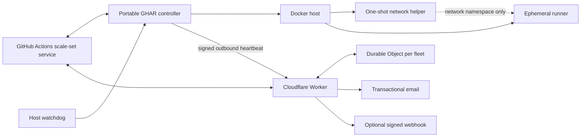

# Portable GHAR Platform Design

<!-- markdownlint-disable MD013 -->

- **Status:** Approved architecture; implementation not started
- **Repository:** `portable-ghar`
- **License:** MPL-2.0
- **Primary audience:** Operators running ephemeral GitHub Actions workloads on a Linux Docker host, with QNAP/QTS as the first reference host

## 1. Decision summary

Portable GHAR is a public, portable control plane for ephemeral GitHub Actions runners on a Linux Docker host.

The first implementation will:

- use the public-preview `actions/scaleset` Go client behind a pinned internal adapter;
- launch one fresh runner container per assigned job;
- keep Docker control, GitHub App credentials, and notification credentials outside job containers;
- install and verify a unique egress jail before each runner listener starts;
- use a host-level watchdog for local recovery;
- use an external Cloudflare Worker and one Durable Object per fleet as the sole automatic failover authority;
- send transactional email as the primary notification and an optional signed webhook as the secondary notification;
- keep all deployment-specific configuration and secrets outside the public repository; and
- keep public-repository CI on GitHub-hosted runners so the project never tests its own runner controller with untrusted pull-request code.

This project is not an official GitHub project. Its scale-set integration depends on a public-preview upstream interface and must be presented as experimental until the compatibility and migration gates in this document pass.

## 2. Goals

1. Replace fixed, always-online runner slots with on-demand ephemeral runners.
2. Preserve one-job/one-environment semantics and destroy job state after completion.
3. Keep untrusted workflow code away from the Docker socket, host filesystems, devices, and control-plane credentials.
4. Fail closed when the runner egress policy cannot be installed or verified.
5. Route work to GitHub-hosted runners when the local fleet is unhealthy.
6. Keep failover authority outside the Docker host and its local network.
7. Support multiple repositories with a fleet-wide capacity ceiling and starvation-resistant admission.
8. Make the implementation portable across Linux Docker hosts through narrow host-adapter interfaces.
9. Make the public repository safe to fork, inspect, build, and contribute to without exposing an operator's identity, topology, or deployment state.
10. Produce reproducible binaries and images with checksums, SBOMs, provenance, and third-party license notices.

## 3. Non-goals

- Kubernetes, Actions Runner Controller, or Kubernetes runner hooks.
- Job containers or service containers orchestrated by the runner.
- Docker-in-Docker or access to a host Docker socket from a job.
- VM-grade isolation.
- Hosting secret-bearing deployment, release, or automation jobs merely because self-hosted capacity exists.
- Supporting arbitrary QTS releases, kernels, CPU architectures, or Docker builds without a verified host profile.
- Guaranteeing that automated scanners can prove the absence of every identifying value.
- Providing a hosted Portable GHAR control-plane service.

## 4. Trust model

### 4.1 Trusted components

- The host operating system and Docker daemon.
- The Portable GHAR controller and its private runtime state.
- The host watchdog.
- The network-policy helper and verifier images.
- The Cloudflare Worker, Durable Object, and configured bindings.
- The controller and failover GitHub Apps.
- The operator's private deployment overlay and secret stores.

Docker control is host-root-equivalent. The controller is therefore a trusted host process even when its Unix account is not UID 0.

### 4.2 Untrusted components

- Repository contents checked out for a job.
- Pull-request code, scripts, build tools, and dependencies.
- Action implementations downloaded for a job.
- Job output, artifacts, and values derived from the job workspace.
- Contributions and issue content submitted to the public repository.

The runner worktree is never promoted into the control plane. Control-plane code does not import, source, execute, or inspect job-owned configuration beyond narrowly defined result metadata.

### 4.3 Bounded job credentials

The JIT runner configuration is secret and is never logged or persisted outside the ephemeral runner.

The upstream runner accepts JIT configuration through `ACTIONS_RUNNER_INPUT_JITCONFIG`, masks it, and removes it from the listener process environment during startup. Docker host metadata and runner configuration files remain inside the trusted-host/ephemeral-container boundary, so the design does not claim that a malicious job can never observe its own one-job runner credentials. The mitigation is scope and lifetime:

- one JIT configuration per runner and per job;
- no reusable controller GitHub App key in the container;
- no host Docker access;
- no cross-job runner reuse; and
- immediate container destruction and credential invalidation after completion or error.

## 5. Architecture



There is no inbound route to the Docker host. The host initiates heartbeat traffic over HTTPS. The Worker is the only automatic writer of workflow routing state.

## 6. Controller design

### 6.1 Internal boundaries

The controller is divided into replaceable units:

| Unit | Responsibility |
| --- | --- |
| Scale-set adapter | Wrap the pinned `actions/scaleset` client and translate upstream types into internal types. |
| Assignment reconciler | Recover assigned jobs after restart and make each transition idempotent. |
| Capacity broker | Enforce a fleet-wide ceiling and fair admission between repositories. |
| Runner lifecycle | Create, release, monitor, and destroy one runner per job. |
| Network jail | Orchestrate the held runner, one-shot helper, independent verifier, and release barrier. |
| Host runtime | Execute a narrow Docker/host command interface without exposing it to jobs. |
| State store | Persist controller job state, outbox records, and reconciliation metadata in a private SQLite database. |
| Health publisher | Emit a heartbeat only after a complete successful reconciliation cycle. |
| Redacting logger | Emit schema-defined fields and reject secret-bearing or job-controlled fields. |

Upstream scale-set structures do not cross the adapter boundary. Compatibility fixtures, startup probes, and contract tests must detect upstream drift before acquisition is enabled.

### 6.2 Capacity and fairness

Capacity is expressed as resource units, not a count of pre-registered runners.

- Each runner profile declares CPU, memory, PID, and scratch-space requests and limits.
- A global ceiling applies across every configured repository.
- Repository queues use weighted round-robin admission with an aging override so low-volume governance jobs cannot starve behind a high-volume repository.
- The controller never advertises more acquirable capacity than the host broker has reserved.
- Host pressure can reduce available capacity but cannot silently raise it above configured limits.
- Zero idle runner containers is the default.

### 6.3 Controller job state

Each assignment has a persisted state machine:

```text
RECEIVED
  -> CAPACITY_RESERVED
  -> RUNNER_HELD
  -> NETWORK_CONFIGURED
  -> NETWORK_VERIFIED
  -> LISTENER_RELEASED
  -> JOB_RUNNING
  -> JOB_FINISHED
  -> DESTROYED
```

Any error before `LISTENER_RELEASED` destroys the runner without accepting work. Any error after release records the ambiguity, stops new acquisition when necessary, reads back GitHub and Docker state, and reconciles to one terminal outcome. Repeating a transition must be a no-op or complete the interrupted transition; it must never launch a duplicate runner for the same assignment.

### 6.4 Safe upgrades

An upgrade proceeds through:

1. route configured repositories to hosted runners;
2. stop new acquisition;
3. drain or cancel assigned jobs according to explicit policy;
4. prove zero listeners and helper containers;
5. replace the pinned controller binary and images;
6. run compatibility and host-profile probes;
7. run a secretless scale-set canary; and
8. restore self-hosted routing only after the external failover state machine confirms the canary.

An upstream compatibility failure leaves acquisition disabled and hosted routing unchanged.

## 7. Per-job isolation

### 7.1 Runner sandbox

Every runner uses:

- a fresh container and work directory;
- no bind mounts or named volumes containing host data;
- no Docker socket;
- no devices;
- a read-only root filesystem;
- bounded executable tmpfs mounts only where required;
- CPU, memory, PID, and scratch-space limits;
- all Linux capabilities dropped;
- `no-new-privileges`;
- a restrictive seccomp profile;
- denial of unprivileged user-namespace creation;
- non-root execution when the verified host profile supports it; and
- no automatic restart policy.

A capability-less root profile may exist only as a named degraded profile when a host's filesystem behavior prevents non-root execution. It is never selected automatically, and its use must be visible in health and audit output.

### 7.2 Network setup barrier

The runner starts in a held entrypoint that cannot launch the listener until the controller writes a one-use readiness token into runner-private tmpfs.

1. Docker creates the runner and its unique network namespace.
2. A pinned helper container joins only that network namespace.
3. The helper receives `NET_ADMIN` and no other capability. It has no Docker socket, host PID/mount/user namespace, host mount, device, runner filesystem, or job input.
4. The helper installs output policy that blocks private, link-local, carrier-grade NAT, metadata, multicast, Docker-host, and locally detected host networks. IPv6 is denied by default.
5. The helper exits.
6. The controller proves the helper is gone.
7. A separate capability-less verifier enters the runner network namespace and runs positive and negative probes against the effective policy.
8. Only after successful verification does the controller create the readiness token.
9. The held entrypoint consumes the token, removes it, and starts the upstream runner listener.

The helper and untrusted listener never execute concurrently. A missing helper exit, failed probe, unexpected route, or policy mismatch destroys the runner.

### 7.3 Egress policy

The default profile is public-internet-only IPv4 egress with explicitly configured public DNS. It does not use a domain allowlist because current build workloads require diverse public registries and package services.

Host profiles must discover and block their real host, bridge, management, and local routes at runtime. A static check for a single private range is insufficient. Tests must cover every blocked class and prove that loss or corruption of policy prevents listener release.

### 7.4 Residual boundary

All runner containers share the host kernel. A kernel or container-runtime escape can bypass container and network controls. Portable GHAR therefore claims container-grade isolation only. Operators requiring VM-grade or hardware-grade isolation must place the Docker host inside an independently isolated VM or network segment.

## 8. Host watchdog and adapters

### 8.1 Watchdog authority

The local watchdog may:

- restart a missing or failed controller;
- reconcile stale controller PID/lock state;
- verify required private files and modes;
- report local health; and
- stop acquisition when host prerequisites fail.

It may not:

- change repository routing;
- mint or store failover GitHub App credentials;
- mark the external state healthy independently of controller reconciliation; or
- run as a Docker container on a host whose Docker daemon it is expected to recover.

### 8.2 Host adapters

The first adapters are:

- QTS persistent host watchdog and Docker CLI integration; and
- standard Linux systemd integration.

Host-specific paths, users, group IDs, schedules, resource ceilings, and Docker networks belong to a private deployment overlay. Public examples contain placeholders and schema-valid synthetic values only.

Each host profile declares minimum kernel/runtime capabilities and includes a positive conformance suite. Unsupported profiles fail closed.

## 9. External failover control plane

### 9.1 Why it is external

A process on the Docker host cannot detect total host, storage, Docker-daemon, power, local-network, or site-uplink failure. The failover writer therefore runs on Cloudflare Workers and does not require inbound access to the host.

### 9.2 Fleet enrollment

The Durable Object owns the fleet epoch. The host does not persist or choose it.

1. A controller instance requests a one-time challenge for a configured fleet identifier.
2. The Worker returns a random, expiring, single-use challenge.
3. The controller creates a random boot/session identifier and returns an HMAC over the fleet identifier, session identifier, and challenge.
4. The Durable Object atomically validates and consumes the challenge, increments the server-owned epoch, invalidates the prior session, and returns the new epoch/session contract.
5. Heartbeat sequence begins at one within that session.

Local controller-state loss causes a new authenticated enrollment rather than a permanent lockout. Old session traffic is rejected after a newer epoch is active.

### 9.3 Heartbeats

A heartbeat is generated only after a successful controller reconciliation and contains allowlisted operational data:

- fleet identifier;
- server-issued epoch and session identifier;
- monotonic session sequence;
- acquisition state;
- available capacity summary;
- assigned-job count and oldest-assignment age;
- last terminal job time;
- host-profile identifier and degraded-profile flag; and
- controller build identifier.

The HMAC authenticates the complete payload. Worker receipt time determines freshness. Client time is diagnostic only. Duplicate, reordered, old-epoch, and replayed messages are rejected.

### 9.4 Durable Object model

One Durable Object is the coordination atom for one fleet. Multiple independent fleets use multiple deterministic objects.

SQLite stores:

- active enrollment epoch and session;
- last accepted sequence and receipt time;
- per-repository route state;
- consecutive health observations;
- current transition epoch and lock;
- a GitHub mutation outbox;
- canary dispatch and result identity;
- notification delivery state; and
- bounded audit events.

Local transition intent and outbox records are committed before external GitHub mutations. A crash or ambiguous API result triggers GitHub read-back and idempotent reconciliation. No external routing write occurs from unpersisted intent.

### 9.5 Failover state machine

```text
BOOTSTRAP
  -> HEALTHY_SELF_HOSTED
  -> SUSPECT
  -> FAILOVER_PENDING
  -> HOSTED_CONFIRMED
  -> RECOVERY_OBSERVED
  -> CANARY_PENDING
  -> CANARY_PASSED
  -> SELF_HOSTED_CONFIRMED
```

Default policy:

- one-minute evaluation cadence;
- configurable stale threshold with a six-minute default;
- at least two consecutive unhealthy evaluations before failover;
- immediate failover eligibility for authenticated fatal controller states;
- sustained healthy observations before recovery canary;
- failback only after a canary tied to the active transition epoch and expected revision succeeds; and
- late or superseded canary results ignored.

If the canary cannot pass, hosted routing remains the safe state. A documented operator recovery procedure may start a new recovery epoch; there is no automatic bypass of a failed canary.

Changing a routing variable affects newly evaluated jobs. It does not migrate or duplicate already assigned hosted jobs, which may complete concurrently with later self-hosted jobs.

### 9.6 GitHub API behavior

The Worker does not poll every repository during steady state. It calls GitHub only for:

- failover/failback mutations;
- canary dispatch and bounded status checks; and
- read-back after ambiguous or partial errors.

Every repository transition is independent, idempotent, and recorded. The Worker honors rate-limit headers and persists retry deadlines. When GitHub is unavailable, it preserves desired state and the last confirmed route; it never reports an unconfirmed mutation as successful.

GitHub API availability is an unavoidable dependency. If the API cannot accept a routing change, Portable GHAR cannot guarantee immediate hosted fallback.

## 10. Notifications

### 10.1 Primary email

The Worker uses a native Cloudflare Email Service binding restricted to configured sender and destination addresses. Deployment onboarding and addresses remain private.

Each email includes both text and HTML bodies and contains only:

- a synthetic fleet/display name;
- transition type and event identifier;
- affected repository aliases safe for notification;
- last confirmed route;
- sanitized reason code;
- Worker receipt time; and
- a generic operator action.

It never includes secrets, heartbeat signatures, request bodies, JIT data, private endpoints, or raw logs.

### 10.2 Secondary webhook

The optional secondary adapter sends the same sanitized event model to a configured HTTPS endpoint with an HMAC signature, timestamp, event ID, and bounded retry policy. A private deployment may bridge this webhook to Signal or another notification system. The public repository does not name a private bridge or include a real destination.

### 10.3 Delivery semantics

Routing transitions and notifications are separate outbox items. Notification failure never reverses or blocks a safety transition.

- Email and webhook deliveries are attempted independently.
- Transient failures use bounded exponential backoff.
- Permanent failures stop retrying and remain visible in Durable Object state and Worker logs.
- Duplicate delivery is possible; event IDs make consumers idempotent.
- Acceptance tests must simulate each channel failing alone and both failing together.

## 11. Authentication and permissions

### 11.1 Controller GitHub App

The controller uses a dedicated GitHub App installed only on explicitly configured repositories. It receives the minimum permissions required by the runner scale-set APIs. Its private key remains on the trusted host in a mode-restricted private overlay and never enters a runner.

### 11.2 Failover GitHub App

The Worker uses a separate GitHub App installed only on configured repositories.

- Repository variables: read/write.
- Actions: read/write only when automatic canary dispatch is enabled.
- Metadata: read.
- No contents, pull-request, administration, issue, deployment, or secret permission unless a later reviewed feature requires it.

A deployment choosing manual failback may omit Actions write permission.

GitHub App private keys and heartbeat HMAC keys are Cloudflare Worker secrets. Installation IDs and repository lists are deployment configuration, not source defaults.

### 11.3 Worker endpoints

- Enrollment and heartbeat endpoints require valid HMAC protocols.
- Challenges are random, single-use, short-lived, and stored transactionally.
- Administrative status or recovery endpoints are disabled by default or protected by a separate service credential.
- Public responses are generic and do not reveal fleet existence, repository inventory, or health state.
- Request bodies and authentication headers are excluded from logs.

## 12. Configuration model

### 12.1 Public configuration

The repository provides schemas and synthetic examples for:

- fleet identity aliases;
- repository aliases and GitHub owner/repository placeholders;
- capacity and fairness policy;
- runner resource profiles;
- host adapter selection;
- network policy classes;
- failover thresholds and canary policy;
- notification feature flags; and
- secret names and binding names.

Examples use values such as `owner/repository`, `example-fleet`, and `operator@example.invalid`. They never use a maintainer's deployment values.

The public Worker configuration omits Cloudflare account identifiers, custom routes, real Worker or Durable Object names, and notification addresses. Deployment tooling supplies those values from the private overlay or the authenticated Cloudflare account.

### 12.2 Private deployment overlay

The private overlay contains:

- actual repository inventory and scale-set names;
- GitHub App and installation identifiers;
- private-key paths or secret-store references;
- host paths, users, group IDs, and schedules;
- host/network discovery results and exceptions;
- Cloudflare account, route, and Durable Object deployment identifiers;
- email sender/recipient values;
- webhook destination and signing key;
- HMAC enrollment key; and
- legacy migration/rollback artifacts.

The overlay is outside the repository, ignored by broad patterns, and mode restricted. Configuration loading rejects unknown fields and rejects secret values in declarative files where only secret references are allowed.

## 13. Public-source sanitization contract

### 13.1 Never commit

- Real personal names, email addresses, phone numbers, or usernames used by a deployment.
- Real hostnames, IP addresses, network ranges, DNS names, device identities, or topology.
- NAS share/home paths, Unix IDs, schedules, or process identifiers from a deployment.
- Actual repository inventory, private runner/scale-set names, or private workflow routing.
- Cloudflare account, zone, tunnel, route, Worker, Durable Object, or binding identifiers.
- GitHub App, client, installation, or private repository identifiers.
- Tokens, private keys, HMAC keys, webhook endpoints, notification destinations, JIT configuration, or credentials.
- Raw operational logs, request bodies, crash dumps, backups, or production state.
- Generated deployment overlays or secret-manager exports.

### 13.2 Automated controls

1. Gitleaks scans full branch-introduced history and tracked content.
2. GitHub native secret scanning and push protection remain enabled.
3. A repository-specific sanitization test rejects private/loopback/link-local literals where not fixture-qualified, PEM blocks, credential-shaped values, personal-path patterns, unsupported example domains, and non-synthetic identifiers.
4. Synthetic fixtures use narrow file-and-line allowlists; global regex exemptions are prohibited.
5. Logs are tested against an allowlisted schema and adversarial secret corpus.
6. Generated binaries, archives, container layers, SBOMs, license files, and release payloads are scanned before publication.
7. An optional untracked private denylist applies deployment-specific patterns during operator pre-publication checks. CI never receives this private list.
8. A release cannot proceed when source, generated-output, or private pre-publication scans fail.

Automated scanning reduces disclosure risk; it cannot prove that every identifying value is absent. Human review remains required for public architecture, examples, logs, issues, and release notes.

## 14. Proposed repository layout

```text
cmd/
  portable-ghar-controller/
internal/
  admission/
  config/
  controller/
  githubscale/
  hostruntime/
  lifecycle/
  networkjail/
  redaction/
  state/
worker/
  src/
  test/
images/
  runner/
  network-helper/
  network-verifier/
deploy/
  qts/
  systemd/
config/
  schema/
  examples/
scripts/
tests/
  integration/
  chaos/
  fixtures/
docs/
  architecture/
  operations/
  security/
  superpowers/specs/
.github/
  workflows/
```

Runtime code stays in small packages with explicit interfaces. Host-specific behavior is confined to `deploy/` and the host-runtime adapter. Cloudflare code does not import controller packages; they communicate only through the versioned heartbeat protocol.

## 15. Public repository governance

### 15.1 Required files

- `README.md`
- `LICENSE` (MPL-2.0 retained)
- `SECURITY.md` with private vulnerability-reporting instructions
- `CONTRIBUTING.md`
- `CODE_OF_CONDUCT.md`
- `CHANGELOG.md`
- `THIRD_PARTY_NOTICES.md`
- `.github/CODEOWNERS`
- pull-request template with public-safety checklist
- structured bug and feature issue forms with redaction warnings
- `.editorconfig`, `.gitattributes`, `.gitignore`, and `.dockerignore`

### 15.2 Repository settings

- Default workflow token permission: read-only.
- Workflows cannot approve pull requests.
- GitHub native secret scanning and push protection enabled.
- Secret validity and non-provider-pattern checks enabled when available and verified not to disclose private patterns.
- Dependabot alerts and security updates enabled.
- Private vulnerability reporting enabled.
- Actions restricted to GitHub-owned actions plus an explicit reviewed allowlist.
- Full commit-SHA pinning required for Actions.
- Branches deleted automatically after merge.
- `main` protected after stable check names have completed once.

The `main` ruleset requires stable checks, resolved conversations, linear history, no force pushes or deletion, and signed commits. Code-owner approval is required when an independent eligible reviewer is available. A sole-maintainer configuration may retain an explicit administrator bypass, but bypass use is visible and never substitutes for required security checks.

## 16. CI and security workflows

All pull-request workflows run on GitHub-hosted runners. They use `pull_request`, never check out fork code under `pull_request_target`, receive no deployment secrets, disable checkout credential persistence, declare least-privilege permissions, set job timeouts, and cancel superseded runs.

Every Action is pinned to a full commit SHA with a comment naming the reviewed release.

### 16.1 Stable required checks

| Check | Coverage |
| --- | --- |
| `go` | Format, vet, tests, race detector, static analysis, and Go vulnerability analysis. |
| `worker` | Lockfile install, lint, typecheck, and Cloudflare-runtime Vitest tests. |
| `shell` | ShellCheck, formatting, and Bats tests for host scripts. |
| `repository-metadata` | Markdown, actionlint, JSON/YAML, schemas, generated docs, and license headers. |
| `sanitization` | Gitleaks-compatible fixtures, forbidden-pattern rules, log-redaction corpus, and generated-output checks. |
| `container` | Dockerfile lint, reproducible build, filesystem/image vulnerability and misconfiguration scan. |
| `dependency-review` | New dependency license and vulnerability review on pull requests. |

### 16.2 Dedicated security workflows

- CodeQL for Go and JavaScript/TypeScript on push, pull request, weekly schedule, and manual dispatch.
- Gitleaks full-history scan on push, pull request, weekly schedule, and manual dispatch.
- OpenSSF Scorecard when its required permissions and publishing behavior are reviewed and pinned.
- Scheduled upstream compatibility probes for the pinned scale-set and runner versions.

### 16.3 Dependency automation

Dependabot covers:

- GitHub Actions;
- Go modules;
- npm;
- Docker base images.

Updates are grouped by ecosystem where safe, rate limited, and must pass the same required checks. Dependabot and Renovate are not used simultaneously.

### 16.4 Releases

A tag-triggered, narrowly permissioned workflow:

1. rebuilds from a clean checkout;
2. runs the full required suite;
3. builds supported binaries and images;
4. scans filesystems and images;
5. generates SPDX or CycloneDX SBOMs and license inventory;
6. generates checksums;
7. creates GitHub provenance attestations for published subjects;
8. publishes immutable artifacts and image digests; and
9. verifies the public release payload with the sanitization gate.

Upstream runner binaries, scale-set binaries, and action archives are never committed. Build inputs are pinned and verified by digest, and third-party license obligations are recorded.

## 17. Testing strategy

### 17.1 Unit and contract tests

- Scale-set adapter message and compatibility fixtures.
- Assignment idempotency, duplicate delivery, and restart recovery.
- Capacity ceilings, fairness, and starvation aging.
- Configuration schema, unknown-field rejection, and secret-reference validation.
- Redaction and sanitization adversarial corpus.
- Worker enrollment, HMAC, challenge expiry, epoch rollover, replay, and sequence ordering.
- Durable Object transition, outbox, retry, and notification state.

### 17.2 Integration tests

- Held runner cannot start before the readiness token.
- Network helper receives only its declared namespace/capability boundary.
- Helper exit and verifier success are both required.
- Public egress works and every prohibited address class fails.
- Runner has no socket, host mount, device, or control-plane secret.
- JIT values are absent from controller logs, job environment, and exported diagnostics.
- One job completes, deregisters, and leaves no reusable workspace or credential material.
- Controller restart reconciles assigned jobs without duplication.
- Host watchdog recovers a dead controller but cannot mutate routing.

### 17.3 Chaos tests

- Controller killed in every lifecycle state.
- Docker daemon unavailable or restarted.
- Helper/verifier killed, delayed, or returning contradictory results.
- Heartbeats delayed, duplicated, reordered, replayed, or dropped.
- Host local state deleted or rolled back before re-enrollment.
- Durable Object request failure before and after outbox commit.
- GitHub mutation timeout, partial repository success, rate limiting, and ambiguous response.
- Canary late success from an obsolete epoch.
- Primary email failure, webhook failure, and both failing together.
- Host reboot and watchdog recovery.

### 17.4 Host conformance

A supported host must positively prove:

- Docker/runtime version and required kernel features;
- CPU, memory, PID, tmpfs, read-only-root, seccomp, and capability enforcement;
- non-root or explicitly acknowledged degraded-root behavior;
- complete egress-policy enforcement from an actual runner namespace;
- no access to host Docker control or private paths; and
- reboot-persistent watchdog behavior.

Structural inspection alone is not sufficient.

## 18. Migration and rollback

### 18.1 Private preparation

Before changing a deployment, capture its live controller/supervisor scripts, images, digests, configuration, watchdog/cron state, external watcher state, and credentials into a private backup. Never use a stale public or local reference as the rollback source.

### 18.2 Canary order

1. Build and test Portable GHAR without accepting assignments.
2. Register scale sets with acquisition disabled.
3. Add a new transition-routing variable that legacy writers do not modify.
4. Route one read-only, secretless consumer workflow through a unique new scale-set label.
5. Prove job lifecycle, isolation, failure recovery, hosted fallback, email, and secondary webhook.
6. Expand by repository and job risk without renaming required checks.
7. Keep secret-bearing, release, deployment-write, and unsupported browser/container jobs hosted unless separately reviewed.

### 18.3 External watcher cutover

The legacy external watcher is retired only after positive observation of:

- Worker and Durable Object deployment and state persistence;
- stale-heartbeat failover;
- fatal-controller-state failover;
- partial GitHub mutation recovery;
- primary email delivery;
- secondary webhook delivery;
- simulated controller, Docker, host, and uplink failures;
- canary-gated failback; and
- the complete rollback rehearsal.

### 18.4 Mutually exclusive rollback barrier

1. Set transition routing to GitHub-hosted runners and read it back.
2. Stop new Portable GHAR acquisition.
3. Drain or cancel assigned new jobs according to policy.
4. Stop the new controller.
5. Prove zero new listeners, runner/helper containers, and pending acquisition.
6. Restore and verify the captured legacy gateway, scripts, writers, and runners while workflows still target hosted runners.
7. Verify complete legacy egress policy, advancing health, and successful secretless canary.
8. Remove the transition variable so new jobs route to the legacy labels.

Starting the legacy fleet before proving the new fleet stopped is prohibited.

### 18.5 Retirement

Preserve legacy rollback artifacts through a defined soak. After the soak and a successful rollback rehearsal:

- revoke obsolete credentials;
- remove legacy writers and watcher jobs;
- remove legacy containers and images only after retained backups are verified;
- retain encrypted rollback material for the documented retention period; and
- update private deployment records without copying them into the public repository.

## 19. Acceptance criteria

### Public safety

- Repository history and generated release payload pass native, generic, and private pre-publication scans.
- No deployment-specific identity, topology, path, repository inventory, notification destination, or credential appears in tracked content.
- Public examples validate without external secrets and use only synthetic values.

### Runner isolation

- A fresh container handles exactly one job and is destroyed.
- Untrusted code cannot access Docker control, host mounts, devices, or control-plane credentials.
- Every blocked egress class fails from the actual runner namespace.
- The listener cannot start until the helper has exited and the independent verifier passes.
- Unsupported host profiles fail closed.

### Control plane

- Duplicate messages and controller restarts do not duplicate job execution.
- Fleet-wide capacity cannot exceed the configured ceiling.
- Upstream compatibility failure prevents acquisition.
- JIT and App credentials do not appear in logs or exported diagnostics.

### Failover

- Durable Object state survives Worker rescheduling.
- Controller state loss safely re-enrolls into a new server-owned epoch.
- Stale/fatal health routes affected repositories hosted and reads back confirmation.
- Ambiguous GitHub responses reconcile idempotently.
- Recovery requires a current-epoch canary; obsolete results cannot fail back.
- Hosted routing remains safe when the canary cannot pass.

### Notifications

- Email and webhook deliver independently with the same sanitized event ID.
- Failure of either or both channels is recorded and retried without blocking failover.
- Notification content passes the public-safety/redaction test corpus.

### Migration

- Required workflow check names remain stable.
- Hosted rollback is available throughout canary and soak.
- The external legacy watcher is not retired before failover and rollback rehearsals pass.
- New and legacy fleets cannot acquire work concurrently during rollback.

## 20. Residual risks and explicit non-claims

| Risk | Treatment |
| --- | --- |
| Shared host kernel | Explicitly accepted container-grade boundary; minimum host profile, seccomp, capabilities, no socket/mounts, live adversarial probes. |
| Public-preview scale-set dependency | Exact pin, adapter isolation, contract fixtures, startup probes, hosted safe-stop before upgrades. |
| GitHub API outage during local failure | Persist desired route and retry; never claim unconfirmed failover. Immediate fallback cannot be guaranteed. |
| Deployment identifier disclosure | Generic and private scans plus human review; no claim of perfect detection. |
| Both notification channels unavailable | Persist delivery failures and retry; routing safety does not depend on notification success. |
| Vendor-specific QTS behavior | Reference adapter plus mandatory live host conformance; unsupported versions fail closed. |
| JIT credentials visible within their one-job trust domain | One-job scope, no reusable App key, ephemeral destruction, no cross-job reuse. |
| Hosted-runner cost during failover | Accepted safety cost; tracked as an operational metric. |

## 21. Implementation phases

1. **Public repository foundation:** governance files, schemas, sanitization controls, hosted CI, CodeQL, secret scanning, dependency automation, and protected-branch settings.
2. **Controller core:** scale-set adapter, state machine, capacity broker, redaction, and fake-runtime tests.
3. **Isolation runtime:** runner/helper/verifier images, Docker host runtime, QTS/systemd adapters, and conformance/chaos suite.
4. **External failover:** Worker, Durable Object, enrollment protocol, GitHub outbox, email, signed webhook, and tests.
5. **Canary and migration:** private overlay, dark deployment, consumer-workflow PRs, watcher cutover, soak, rollback rehearsal, and legacy retirement.
6. **Release hardening:** reproducible artifacts, SBOM, provenance, third-party notices, upgrade compatibility automation, and supported-host matrix.

Each phase receives a separate implementation plan and review gate. No deployment phase starts merely because an earlier source phase merged.

## 22. Design review record

The design received a three-pass independent adversarial review before this specification was committed.

Material changes integrated from review:

- server-owned enrollment epochs instead of trusting locally persisted sequence state;
- Worker receipt time instead of client time for freshness;
- epoch-scoped GitHub mutation outbox and late-canary rejection;
- explicit partial-API/rate-limit reconciliation;
- mutually exclusive new/legacy rollback barrier;
- private, untracked deployment-specific pre-publication scanning;
- generated-artifact and release-payload scanning;
- mandatory legacy restore rehearsal;
- exact listener readiness barrier after helper exit and independent verification; and
- explicit shared-kernel and GitHub-API residual risks.

The remaining strongest concern is the shared-kernel container boundary. That concern is accepted only within the explicit non-VM design and is not represented as stronger isolation than it provides.
